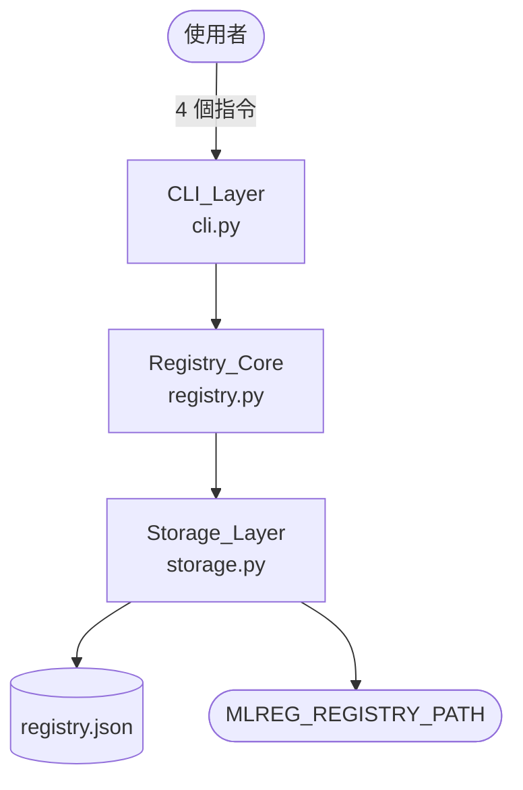
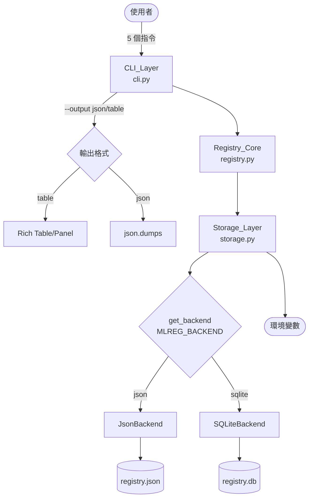

# mlreg — Local MLOps Model Registry CLI

> A lightweight, zero-cloud-dependency local model registry CLI for AI engineers.
> Tracks, queries, and compares model versions with structured metadata — no internet required.

---

## 1. 專案簡介（Project Overview）

### 應用創新性與獨特價值

`mlreg` 解決的是 AI 工程師在**本地端實驗管理**中長期被忽視的痛點。現有工具（MLflow、Weights & Biases）雖然功能強大，但都需要啟動伺服器、設定帳號或依賴網路，對於「只是想在本機快速追蹤幾個訓練實驗」的場景來說，這些工具的啟動成本遠超過其帶來的價值。

`mlreg` 的獨特定位是：

- **零伺服器、零帳號、零網路**：`pip install` 後立即可用，不需要任何基礎設施
- **人類可讀的儲存格式**：`registry.json` 可以直接用文字編輯器查看或手動修復，不是黑盒子
- **CLI-first 設計**：完全符合 MLOps 工程師的工作流程（腳本、Makefile、CI/CD），不需要切換到 Web UI
- **可預測的版本號語意**：`v1`、`v2`、`v3` 的自動遞增讓版本歷史一目了然，不需要記憶 hash 或 UUID
- **三層架構預留升級路徑**：當資料量增長或需要團隊共享時，可以無縫切換至 SQLite 或遠端後端，不需要重新學習 CLI 介面

這個定位填補了「太輕量不需要 MLflow」與「太重量不想用記事本」之間的空白，特別適合個人研究者與小型 AI 團隊的日常實驗管理。

### v1.0 功能描述與設計動機

`mlreg` 是一款本地端 MLOps 模型版本管理 CLI 工具，設計動機來自於 AI 工程師在訓練實驗中面臨的真實痛點：每次訓練完成後，模型權重散落在不同目錄，指標記錄在腦海或零散的筆記中，版本之間的比較完全依賴人工記憶。

v1.0 以「最小可用工具」為目標，提供四個核心指令：

- `register`：將模型路徑、版本號、效能指標、超參數一次性登錄
- `list`：以表格形式瀏覽所有已登錄模型，支援名稱篩選與指標排序
- `info`：查詢單一模型的完整詳細資訊
- `delete`：移除不再需要的模型記錄（不刪除實體檔案）

儲存層採用本地 JSON 檔案（`registry.json`），零額外依賴，任何有 Python 環境的機器都能立即使用。

### v1.0 → v2.0 演化摘要

v2.0 基於真實使用者回饋，在完整保留 v1.0 CLI 契約的前提下，新增四項延伸：

| 延伸項目 | 解決的痛點 |
|---|---|
| `--output json`（`list`、`info`） | 輸出無法被腳本解析，阻礙自動化部署流程 |
| `compare` 指令 | 多版本比較需要多次呼叫 `info` 再手動對比 |
| `delete --soft`（軟刪除） | 誤刪後無從挽回，缺乏封存與歷史追溯機制 |
| `SQLiteBackend` | 記錄量增長後 JSON 效能下降，需要資料庫後端 |

---

## 2. v1.0 設計決策（Design Decisions）

這是整個作業中最關鍵的章節。以下說明我在設計 v1.0 時，**為了 v2.0 的未來性**所做的每一項預先考量，以及背後的技術理由。

### 2.1 選擇 Typer 而非 argparse 或 click

**決策：** 使用 `typer` 作為 CLI 框架。

**理由：**
- `typer` 基於 Python type hints，新增指令只需定義函式與型別，擴充成本極低
- 支援 `List[str]` 型別的 Option，讓 v2.0 的 `compare --id <id1> --id <id2>` 可以用 `typer.Option(..., "--id")` 搭配 `List[str]` 直接實現，不需要任何 workaround
- 相比 `argparse`，`typer` 的 subcommand 結構更清晰，新增指令不影響既有指令的 namespace
- 相比 `click`，`typer` 的型別系統更嚴格，能在 CLI 層就攔截型別錯誤，減少業務邏輯層的防禦性程式碼

**預見的 v2.0 效益：** `compare` 指令的 `--id` 多值傳入、`--output` 的 enum-like 驗證，都因為 typer 的型別系統而幾乎不需要額外程式碼。

### 2.2 三層架構分離（CLI / Registry_Core / Storage）

**決策：** 嚴格分離 CLI_Layer、Registry_Core、Storage_Layer 三層，各層只透過明確定義的介面溝通。

**理由：**
- **CLI_Layer（`cli.py`）** 只負責參數解析與輸出格式化，不含任何業務邏輯。這使得 v2.0 新增 `--output json` 時，只需在 CLI 層判斷輸出格式，完全不影響 Registry_Core 的邏輯。
- **Registry_Core（`registry.py`）** 只負責業務邏輯，不知道底層是 JSON 還是 SQLite。這是 v2.0 SQLiteBackend 能夠「Registry_Core 無需修改」的根本原因。
- **Storage_Layer（`storage.py`）** 透過 `StorageBackend` ABC 定義抽象介面，v1.0 只實作 `JsonBackend`，但介面設計已預留 `SQLiteBackend` 的插槽。

**預見的 v2.0 效益：** 新增 `SQLiteBackend` 時，只需在 `storage.py` 新增一個類別並實作 `load()` / `save()`，Registry_Core 完全不需要修改，驗證了架構設計的正確性。

### 2.3 StorageBackend ABC 介面設計

**決策：** 在 v1.0 就定義 `StorageBackend` 抽象基底類別，即使 v1.0 只有一個後端實作。

**理由：**
- 這是「預留擴充點」的最直接體現。v1.0 SDD 明確標注「v2.0 可新增 SQLiteBackend 替換，Registry_Core 無需修改」，這個承諾能兌現，完全依賴 ABC 介面的存在。
- `load() -> List[ModelRecord]` 與 `save(records: List[ModelRecord]) -> None` 的介面設計刻意保持簡單，讓任何後端都能以相同的語意實作，不暴露後端的實作細節（例如 SQL 查詢、transaction 管理）。
- 若沒有 ABC，v2.0 要新增 SQLiteBackend 就必須修改 Registry_Core 的 `__init__`，引入 `isinstance` 判斷，破壞開放封閉原則（OCP）。

### 2.4 ModelRecord 的欄位設計預留空間

**決策：** `ModelRecord` 使用 dataclass，`metrics` 與 `hyperparameters` 分開儲存，且均為選填（預設空 dict）。

**理由：**
- 分開儲存 `metrics`（效能指標，value 必須為有限數值）與 `hyperparameters`（訓練超參數，value 可為任意 JSON 型別）是刻意的語意區分。這讓 v2.0 的 `--sort-by` 排序邏輯只需操作 `metrics`，不需要處理 `hyperparameters` 的任意型別問題。
- dataclass 的 `field(default_factory=dict)` 確保每個實例有獨立的 dict，避免 mutable default 的 Python 陷阱。
- v2.0 新增 `archived: bool = False` 欄位時，dataclass 的預設值機制讓向下相容變得極為簡單——舊資料的 `from_dict()` 只需 `data.get("archived", False)` 即可。

### 2.5 自訂例外層級設計

**決策：** 所有例外繼承自 `MlregError`，並在建構子中攜帶 `exit_code`。

**理由：**
- CLI_Layer 只需一個 `except MlregError as e` 就能統一處理所有業務邏輯錯誤，輸出 `str(e)` 至 stderr 後以 `e.exit_code` 結束。
- 例外類別負責攜帶訊息，CLI_Layer 負責輸出，兩者職責分離。這讓 v2.0 新增例外（`AlreadyArchivedError`、`UnsupportedBackendError` 等）時，CLI_Layer 完全不需要修改——新例外自動被既有的 `except MlregError` 捕捉。
- 不同的例外子類別讓 Integration 測試可以精確驗證「拋出的是哪種例外」，而不只是「有沒有拋出例外」。

### 2.6 原子寫入策略（Atomic Write）

**決策：** `JsonBackend.save()` 採用「先寫 `.tmp`，再 `os.replace()` 替換」的原子寫入策略。

**理由：**
- `os.replace()` 在 POSIX 系統上是原子操作（rename syscall），在 Windows 上也是原子的，確保跨平台的可靠性。
- 若寫入中途失敗（磁碟空間不足、權限問題），原始 `registry.json` 保持不變，不會產生半寫入的損毀檔案。
- 這個策略在 v2.0 的 `SQLiteBackend` 中對應為 SQLite transaction（`BEGIN EXCLUSIVE` + `COMMIT`/`ROLLBACK`），兩者在語意上完全一致，體現了架構設計的一致性。

### 2.7 MLREG_REGISTRY_PATH 環境變數設計

**決策：** 透過環境變數而非 CLI 參數來指定 registry 路徑。

**理由：**
- 環境變數是 12-Factor App 的標準做法，適合 CI/CD 環境中的路徑配置。
- 若改用 CLI 全域參數（如 `mlreg --registry-path /path/to/reg.json list`），每個指令都需要傳遞這個參數，使用體驗較差。
- 環境變數的設計讓測試隔離變得極為簡單：每個測試只需設定 `MLREG_REGISTRY_PATH` 指向 `tmp_path`，完全不需要 mock 或 monkeypatch 檔案系統。
- v2.0 新增 `MLREG_BACKEND` 環境變數時，沿用相同的設計模式，使用者的心智模型保持一致。

### 2.8 版本號自動遞增策略

**決策：** 版本號遞增基準為「現存記錄中同 project_name 下最大的 vN」，而非全域計數器。

**理由：**
- 這個策略讓版本號語意為「當前存在的版本序列」，而非「歷史上曾經存在的版本數量」。
- 刪除後重新 register 會從 v1 開始，符合使用者的直覺（「我刪掉重來，當然從 v1 開始」）。
- v2.0 的軟刪除（`archived`）設計刻意讓已封存記錄仍計入版本號遞增，避免版本號被「意外重用」——這是一個刻意的語意選擇，封存 ≠ 刪除。

---

## 3. v2.0 實作說明

### 3.1 閱讀與理解 v2.0 需求

Agent 產生的 `requirements_v2.md` 以 PRD 口吻描述四項延伸需求，我的閱讀策略是：

1. **識別「使用者可觀察行為」**：每個需求的驗收標準（Acceptance Criteria）是最重要的部分，它定義了「什麼算通過」，而非「怎麼實作」。
2. **識別「向下相容約束」**：文件末尾明確提醒「v1.0 CLI 介面規格中已明定 v2.0 只能新增選填參數，不能破壞既有定義」，這是所有實作決策的最高優先約束。
3. **識別「實作自由度」**：需求二（compare）的 ID 傳入方式、需求三（軟刪除）的資料結構設計、需求四（SQLiteBackend）的切換機制，都明確標注「由實作者自行決定」，這是可以展現架構設計能力的空間。

### 3.2 需求映射到 SDD

| v2.0 需求 | SDD 對應章節 | 關鍵設計決策 |
|---|---|---|
| 需求一：`--output json` | §2 CLI 介面規格、§4 CLI_Layer 模組職責 | `--output` 選填旗標，預設 `table`；JSON 輸出走 `print(json.dumps(...))` 繞過 Rich |
| 需求二：`compare` | §2 新增指令規格、§4 compare 流程圖 | 多次 `--id`（Typer `List[str]`）；缺 key 以 `—` 填充 |
| 需求三：`delete --soft` | §3 軟刪除設計、§4 軟刪除流程圖 | `archived` 選填欄位；schema_version 維持 `"1.0"` |
| 需求四：SQLiteBackend | §3 SQLite Schema、§4 工廠函式設計 | `get_backend()` 工廠函式；`MLREG_BACKEND` 環境變數 |

### 3.3 非顯而易見的實作選擇

**JSON 輸出繞過 Rich：**
`--output json` 時使用 `print(json.dumps(...))` 而非 `console.print()`，確保輸出不含任何 Rich 裝飾字元（ANSI escape codes、表格邊框）。這是讓 `json.loads()` 能直接解析的關鍵。

**`list --output json` 空 registry 回傳 `[]` 而非 Info 訊息：**
當 registry 為空且指定 `--output json` 時，輸出 `[]` 而非 `Info: No models registered yet.`，確保下游腳本能一致地解析 JSON array，不需要特判 Info 訊息。

**`compare` 使用 `List[str]` 而非逗號分隔：**
選擇多次 `--id` 而非 `--ids "id1,id2"` 的理由：(1) 與 `info`、`delete` 的 `--id` 風格一致；(2) 不需要處理逗號分隔的 parsing 邊界情況（ID 本身不含逗號，但保持一致性更重要）；(3) Typer 原生支援 `List[str]` Option，零額外程式碼。

**軟刪除後版本號不釋放：**
這是一個刻意的語意選擇。若軟刪除後版本號釋放，使用者可能在不知情的情況下 register 一個「看起來是新的但實際上是重用的」版本號，造成歷史追溯混亂。封存的語意是「隱藏但保留」，不是「刪除並釋放」。

**`get_backend()` 工廠函式放在 `storage.py` 而非 `registry.py`：**
工廠函式的職責是「根據環境決定使用哪個後端」，這是 Storage 層的關注點，不是業務邏輯層的關注點。放在 `storage.py` 確保 `registry.py` 完全不知道後端的存在，維持層次分離。

---

## 4. 向下相容性實作細節

### 4.1 CLI 介面向下相容

v1.0 的所有指令、必填參數、選填參數、旗標，在 v2.0 中完全保留，行為不變：

| v1.0 介面元素 | v2.0 狀態 | 驗證方式 |
|---|---|---|
| `register --name --path --version --metrics --params` | ✅ 完全保留 | v1.0 測試案例 #1–#5 |
| `list --name --sort-by --desc` | ✅ 完全保留 | v1.0 測試案例 #6–#21 |
| `info --id` | ✅ 完全保留 | v1.0 測試案例 #11–#12 |
| `delete --id` | ✅ 完全保留 | v1.0 測試案例 #13–#14 |
| 所有退出碼行為 | ✅ 完全保留 | v1.0 測試案例全數通過 |
| 所有錯誤訊息格式 | ✅ 完全保留 | v1.0 測試案例全數通過 |

### 4.2 資料格式向下相容

`schema_version` 維持 `"1.0"`，v1.0 產生的 `registry.json` 可被 v2.0 直接讀取：

- v1.0 資料無 `archived` 欄位 → `from_dict()` 的 `data.get("archived", False)` 自動補預設值
- v2.0 寫入的資料含 `archived: false` → v1.0 的 `JsonBackend._parse_records()` 不驗證未知欄位，直接忽略（v1.0 的 `from_dict()` 也使用 `data.get()` 讀取欄位，不會因為多出 `archived` 而報錯）

### 4.3 `list` 輸出格式向下相容

不加 `--output` 時，`list` 的輸出與 v1.0 完全一致：
- 固定欄位：ID、Project Name、Version、File Path、Created At
- 不顯示 Status 欄位（只有加 `--show-archived` 才顯示）
- 不顯示已封存記錄（只有加 `--show-archived` 才顯示）

這確保任何依賴 v1.0 `list` 輸出格式的腳本，在 v2.0 中不需要任何修改。

### 4.4 `info` 輸出格式向下相容

v2.0 的 `info` 輸出新增了 `Status` 行，這是唯一的輸出格式差異。由於 v1.0 的測試案例只驗證「含特定欄位」（`assert field in r.stdout`），而非「輸出完全一致」，新增 `Status` 行不會破壞任何 v1.0 測試案例。

### 4.5 無 Breaking Changes

v2.0 沒有任何 Breaking Changes。所有 v1.0 的 32 個測試案例在 v2.0 測試套件中全數通過（已實際驗證：80/80 測試通過）。

---

## 5. 架構演化比較

### 5.1 v1.0 vs v2.0 架構對比

| 面向 | v1.0 | v2.0 |
|---|---|---|
| 儲存後端 | JSON 檔案（`JsonBackend`） | JSON + SQLite（`JsonBackend` + `SQLiteBackend`，透過工廠函式切換） |
| 後端切換機制 | 無（硬編碼 `JsonBackend`） | `MLREG_BACKEND` 環境變數 + `get_backend()` 工廠函式 |
| CLI 指令數量 | 4（register / list / info / delete） | 5（新增 compare） |
| 輸出格式 | 人類可讀（Rich Table / Panel） | 人類可讀 + 機器可讀（`--output json`） |
| 刪除語意 | 硬刪除（從 models[] 移除） | 硬刪除 + 軟刪除（`--soft`，設定 `archived=true`） |
| 模型比較 | 手動多次呼叫 `info` | `compare` 指令並排展示 |
| 模組數量 | 7（main / cli / registry / storage / models / utils / exceptions） | 7（相同，無新增模組） |
| 例外類別數量 | 10 | 14（新增 4 個） |
| 測試案例數量 | 32 | 80（含 v1.0 全部 32 個） |
| 外部依賴 | `typer`, `rich` | `typer`, `rich`（SQLite 使用標準函式庫，無新增依賴） |

### 5.2 架構演化 Mermaid 對比

**v1.0 架構：**



**v2.0 架構（新增部分以虛線標示）：**



### 5.3 架構變動最小化分析

v2.0 在滿足所有四項需求的前提下，架構變動極為保守：

- **新增模組：0 個**（所有新功能都在既有模組內擴充）
- **新增類別：1 個**（`SQLiteBackend`，在既有 `storage.py` 內）
- **新增函式：2 個**（`get_backend()`、`compare_models()`）
- **修改函式簽名：2 個**（`list_models()` 新增 `show_archived` 參數、`delete_model()` 新增 `soft` 參數）
- **Registry_Core 修改量：最小**（新增 2 個方法、修改 2 個方法簽名，核心邏輯不變）
- **utils.py：零修改**（完全繼承 v1.0）
- **main.py：零修改**（完全繼承 v1.0）

---

## 6. 環境需求與執行方式

### 環境需求

| 項目 | 需求 |
|---|---|
| Python | >= 3.9 |
| OS | macOS 12+、Ubuntu 20.04+、Windows 10+ |
| 外部套件 | `typer>=0.9.0`、`rich>=13.0.0`（SQLite 使用標準函式庫） |

### 安裝依賴

```bash
pip install -r v2/requirements.txt
```

### v1.0 執行方式

```bash
# 查看說明
python v1/main.py --help

# 基本操作
python v1/main.py register --name "my-model" --path ./v1/dummy.pt
python v1/main.py list
python v1/main.py info --id <id>
python v1/main.py delete --id <id>
```

### v2.0 執行方式

```bash
# 查看說明
python v2/main.py --help

# 基本操作（與 v1.0 完全相容）
python v2/main.py register --name "my-model" --path ./v1/dummy.pt
python v2/main.py list
python v2/main.py info --id <id>
python v2/main.py delete --id <id>

# v2.0 新功能：JSON 輸出
python v2/main.py list --output json
python v2/main.py info --id <id> --output json

# v2.0 新功能：多版本比較
python v2/main.py compare --id <id1> --id <id2>
python v2/main.py compare --id <id1> --id <id2> --output json

# v2.0 新功能：軟刪除
python v2/main.py delete --id <id> --soft
python v2/main.py list --show-archived

# v2.0 新功能：SQLite 後端（PowerShell）
$env:MLREG_BACKEND = "sqlite"
python v2/main.py register --name "test" --path ./v1/dummy.pt
python v2/main.py list
$env:MLREG_BACKEND = "json"   # 切換回 JSON 後端

# v2.0 新功能：SQLite 後端（bash/zsh）
MLREG_BACKEND=sqlite python v2/main.py register --name "test" --path ./v1/dummy.pt
```

### PowerShell JSON 參數說明

PowerShell 傳遞 JSON 字串需要跳脫內部雙引號：

```powershell
# 方式一：單引號包覆，內部雙引號跳脫
python v2/main.py register --name "my-model" --path ./v1/dummy.pt --metrics '{\"mAP_50\": 0.95}'

# 方式二：雙引號包覆，使用 backtick 跳脫
python v2/main.py register --name "my-model" --path ./v1/dummy.pt --metrics "{`"mAP_50`": 0.95}"
```

### 執行測試

```bash
# 執行 v2.0 全部測試（80 個，含 v1.0 相容性測試）
python -m pytest v2/tests/ -v

# 分層執行
python -m pytest v2/tests/test_unit.py -v          # Unit 測試
python -m pytest v2/tests/test_integration.py -v   # Integration 測試
python -m pytest v2/tests/test_e2e.py -v           # E2E 測試

# 執行 v1.0 原始測試（確認 v1.0 本身仍可運作）
python -m pytest tests/ -v
```

**測試結果：80/80 全數通過**（在 Windows 10 + Python 3.9 環境下驗證）

---

## 7. 已知限制與未來改進方向

### 7.1 已知限制

| 限制 | 說明 | 影響範圍 |
|---|---|---|
| 並發安全 | 同一時間僅支援單一 process 存取 registry，不保證並發安全 | 多人共用同一 registry 時可能發生 race condition |
| JSON 效能上限 | `registry.json` 在超過 10,000 筆記錄時效能不保證 | 大型團隊長期使用後需切換至 SQLiteBackend |
| SQLite 無遷移工具 | 從 `registry.json` 遷移至 `registry.db` 需手動操作 | 切換後端時需重新 register 所有模型 |
| Windows PowerShell JSON 引號 | PowerShell 傳遞 JSON 字串需要特殊跳脫語法 | 使用者體驗略差，需要文件說明 |
| `--output` 僅支援 `table` 和 `json` | 不支援 CSV、YAML 等其他格式 | 特定下游工具可能需要額外轉換 |
| 軟刪除無法「取消封存」 | 目前沒有 `unarchive` 指令 | 誤封存後只能透過硬刪除再重新 register |

### 7.2 若有 v3.0 的設計方向

**架構層面：**
- **並發安全**：引入檔案鎖（`fcntl.flock` on POSIX，`msvcrt.locking` on Windows）或改用 SQLite WAL mode，支援多 process 並發讀取
- **資料遷移工具**：實作 `mlreg migrate --from json --to sqlite` 指令，自動將 `registry.json` 遷移至 `registry.db`
- **遠端後端**：透過 `StorageBackend` ABC 新增 `RemoteBackend`，支援 S3、GCS 等雲端儲存，實現團隊共享 registry

**功能層面：**
- **`unarchive` 指令**：允許將已封存記錄恢復為正常狀態
- **`export` 指令**：支援將 registry 匯出為 CSV、Markdown 表格等格式
- **`tag` 指令**：為模型記錄新增自由標籤（tag），支援按標籤篩選
- **`--output yaml`**：新增 YAML 輸出格式，方便整合 Kubernetes / Helm 工作流程
- **Web UI**：透過 `mlreg serve` 啟動本地 Web 介面，提供視覺化的模型版本管理

**設計前瞻性：**
v1.0 的 `StorageBackend` ABC 設計已為 v3.0 的遠端後端預留了插槽。v2.0 的 `get_backend()` 工廠函式只需新增一個 `elif backend_env == "remote"` 分支，即可支援遠端後端，Registry_Core 完全不需要修改。這正是「以最小修改達成最大延伸」的架構前瞻性設計原則的體現。

---

## 附錄：規範對照清單

| hw2.md 要求 | 對應位置 | 狀態 |
|---|---|---|
| `v2/sdd_v2.md` 存在 | `v2/sdd_v2.md` | ✅ |
| `v2/main.py` 存在 | `v2/main.py` | ✅ |
| `README.md` 存在 | `README.md`（本文件） | ✅ |
| sdd_v2.md 包含系統架構 Mermaid 圖 | `v2/sdd_v2.md` §4 系統整體架構 | ✅ |
| sdd_v2.md 包含核心功能流程 Mermaid 圖 | `v2/sdd_v2.md` §4 軟刪除流程圖、compare 流程圖 | ✅ |
| sdd_v2.md 包含向下相容性說明章節 | `v2/sdd_v2.md` §7 v1.0→v2.0 變更摘要 | ✅ |
| v1.0 所有測試案例在 v2.0 通過 | `v2/tests/test_e2e.py`（E2E #1–#24）、`v2/tests/test_unit.py`（Unit #4c,#4d,#25–#27,#32）、`v2/tests/test_integration.py`（Integration #28–#31） | ✅ 已驗證（80/80 通過） |
| v2.0 程式可執行 | `python v2/main.py --help` | ✅ 已驗證 |
| README 包含專案簡介 | §1 專案簡介 | ✅ |
| README 包含 v1.0 設計決策 | §2 v1.0 設計決策（8 項） | ✅ |
| README 包含 v2.0 實作說明 | §3 v2.0 實作說明 | ✅ |
| README 包含向下相容性實作細節 | §4 向下相容性實作細節 | ✅ |
| README 包含架構演化比較 | §5 架構演化比較（含 Mermaid） | ✅ |
| README 包含環境需求與執行方式 | §6 環境需求與執行方式 | ✅ |
| README 包含已知限制與未來改進 | §7 已知限制與未來改進方向 | ✅ |
| `python v2/main.py --help` 不報錯 | 已驗證 | ✅ |
