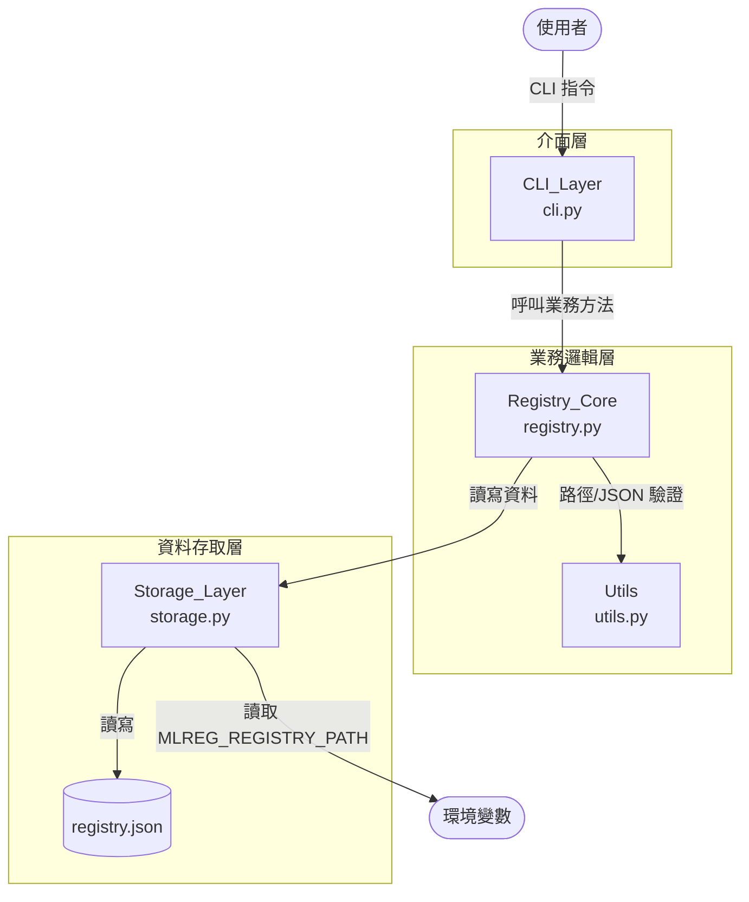
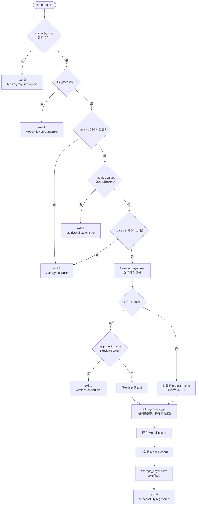

# Software Design Description (SDD)
## mlreg — Local MLOps Model Registry CLI

## 1. 專案概覽（Project Overview）

- **程式名稱：** `mlreg`（Local Model Registry）
- **程式版本：** v1.0
- **簡短描述（Elevator Pitch）：** 一款輕量級的本地端 MLOps 模型註冊與版本控制 CLI 工具，讓 AI 工程師能以結構化方式追蹤、查詢與比較模型版本，無需依賴任何雲端或網路服務。
- **目標使用者：** 個人研究者、小型 AI 團隊、需要本地端模型資產管理的 MLOps 工程師
- **核心價值：** 以僅依賴輕量 CLI 函式庫的本地 JSON 儲存，提供統一的模型版本管理介面，支援多版本追蹤、效能指標排序與篩選，並預留三層架構供 v2.0 平滑升級至資料庫後端

### 設計目標與品質屬性（Quality Attributes）

| 屬性 | 目標 | 驗證方式 |
|---|---|---|
| 正確性 | 所有 CLI 指令的輸出與退出碼符合第 2、5 章規格 | 第 6 章 E2E 測試案例全數通過 |
| 可靠性 | 寫入中途失敗不得損毀現有 registry.json | 原子寫入策略（第 4 章）；案例 #28 |
| 可維護性 | Storage 層可替換為 SQLiteBackend 而不修改 Registry_Core | StorageBackend ABC 介面（第 4 章） |
| 可移植性 | 支援 macOS、Linux、Windows（bash / PowerShell / CMD） | OS 支援矩陣（見下方假設與限制） |
| 預期資料量 | 單一 registry.json 支援至多 10,000 筆 ModelRecord；超過此數量時效能不保證 | 屬 v2.0 升級觸發條件，不在 v1.0 測試範疇 |

### System Context

```
┌─────────────────────────────────────────────────────────┐
│  使用者（AI 工程師）                                      │
│    │  CLI 指令（mlreg register / list / info / delete）  │
│    ▼                                                     │
│  mlreg CLI（v1.0）                                       │
│    │  讀取 MLREG_REGISTRY_PATH 環境變數                  │
│    │  讀寫 registry.json（預設：執行目錄）                │
│    │  驗證 --path 指定的模型檔是否存在                    │
│    ▼                                                     │
│  本地檔案系統                                             │
│    ├── registry.json（由 mlreg 管理）                    │
│    └── 模型權重檔（由使用者管理，mlreg 只驗證存在性）      │
└─────────────────────────────────────────────────────────┘
```

**責任邊界：**
- mlreg 負責：registry.json 的建立、讀取、寫入、原子替換
- mlreg 不負責：模型檔的搬移、複製、備份或刪除
- mlreg 不負責：registry.json 的備份或版本控制
- `MLREG_REGISTRY_PATH` 由 `storage.py`（JsonBackend）在初始化時讀取，優先序高於預設執行目錄

### 範疇外（Out of Scope）

以下功能明確不在 v1.0 範疇內，並附設計取捨理由：

| 排除項目 | 設計取捨理由 |
|---|---|
| 遠端／雲端儲存後端 | v1.0 目標為零網路依賴的本地工具；雲端整合留待 v2.0 透過 StorageBackend ABC 擴展 |
| 並發寫入（多 process） | 本地單人使用場景不需要鎖定機制；並發安全會引入複雜度，與輕量目標相悖 |
| 模型檔案的上傳、複製或搬移 | mlreg 只管理 metadata，不管理檔案資產，避免與使用者的檔案管理流程衝突 |
| Web UI 或 REST API | CLI 是 MLOps 工程師的主要工作介面；GUI 層留待 v2.0 |
| 模型版本間的自動比較或 diff | 使用者可透過 `list --sort-by` 手動比較；自動 diff 需要語意理解，超出 v1.0 範疇 |
| 多使用者或權限控管 | 目標使用者為個人或小型團隊，依賴 OS 檔案系統權限即可 |
| 機器可讀輸出（--output json） | v1.0 輸出格式為人類可讀；機器可讀介面留待 v2.0 |

### 假設與限制（Assumptions & Constraints）

| 項目 | 說明 |
|---|---|
| Python 版本 | >= 3.9 |
| OS 支援矩陣 | macOS 12+、Ubuntu 20.04+、Windows 10+（bash / PowerShell / CMD） |
| 執行環境 | 具備 registry.json 所在目錄的讀寫權限 |
| 並發存取 | 同一時間僅由單一 process 存取 `registry.json`，不保證並發安全 |
| 模型路徑 | 僅支援本地絕對路徑或相對路徑，不支援 URL 或網路路徑 |
| Path Encoding | 路徑字串以 UTF-8 處理；非 UTF-8 路徑行為未定義 |
| Symbolic Link | `--path` 指定 symlink 時，驗證 symlink 本身存在即可（不追蹤 target）；registry.json 路徑不得為 symlink |
| registry.json 路徑 | 預設為執行目錄下的 `registry.json`；可透過環境變數 `MLREG_REGISTRY_PATH` 覆蓋（需為合法檔案路徑，不可為目錄） |
| 外部依賴 | 僅依賴 `typer`、`rich` 兩個輕量 CLI 函式庫，無雲端或網路依賴 |

---

## 2. CLI 介面規格（Interface Specification）

> 本節為 v1.0 向下相容契約。v1.0 凍結後，既有必填參數的名稱與行為不可修改或刪除；
> v2.0 只能新增選填參數，不能破壞既有定義。

### 指令規格

```
mlreg <command> [OPTIONS]
```

| 指令 | 參數 | 說明 | 範例 |
|---|---|---|---|
| `register` | `--name TEXT`（必填） | 專案/模型群組名稱 | `mlreg register --name "pig-pose" --path ./best.pt` |
| | `--path TEXT`（必填） | 模型權重檔本地路徑（需存在） | |
| | `--version TEXT`（選填） | 指定版本號；未指定時自動遞增（v1, v2...） | `--version "v3"` |
| | `--metrics JSON`（選填） | 效能指標 key-value JSON，預設 `{}` | `--metrics '{"mAP_50": 0.95, "loss": 0.035}'` |
| | `--params JSON`（選填） | 訓練超參數 key-value JSON，預設 `{}` | `--params '{"epochs": 300, "batch_size": 16}'` |
| `list` | `--name TEXT`（選填） | 篩選指定 project_name | `mlreg list --name "pig-pose"` |
| | `--sort-by TEXT`（選填） | 依指定 metric key 排序（預設升冪） | `mlreg list --sort-by mAP_50` |
| | `--desc`（flag，選填） | 啟用降冪排序，需搭配 `--sort-by` | `mlreg list --sort-by mAP_50 --desc` |
| `info` | `--id TEXT`（必填） | 查詢指定 ID 的模型完整資訊 | `mlreg info --id m_1710903810_a3f2` |
| `delete` | `--id TEXT`（必填） | 刪除指定 ID 的模型紀錄（不刪除實體檔案，無需 confirm） | `mlreg delete --id m_1710903810_a3f2` |

> **Shell 相容性說明：** `--metrics` 與 `--params` 的 JSON 字串在不同 shell 的引號語法不同：
> - bash / zsh：`--metrics '{"mAP_50": 0.95}'`（單引號包覆）
> - PowerShell：`--metrics '{"mAP_50": 0.95}'`（單引號包覆，PowerShell 5.1+ 支援）
> - CMD：`--metrics "{\"mAP_50\": 0.95}"`（雙引號包覆，內部跳脫）

### 邊界行為規格

| 情境 | 行為 | 退出碼 |
|---|---|---|
| `registry.json` 不存在時執行 `register` | 自動建立新的 `registry.json`，正常執行 | 0 |
| `registry.json` 不存在時執行 `list` | 視同 Registry 為空，stdout 輸出 `Info: No models registered yet.` | 0 |
| `registry.json` 不存在時執行 `info` | stderr 輸出 `Error: Model ID '<id>' not found in registry.` | 1 |
| `registry.json` 不存在時執行 `delete` | stderr 輸出 `Error: Model ID '<id>' not found in registry.` | 1 |
| `MLREG_REGISTRY_PATH` 指向一個目錄（非檔案） | stderr 輸出 `Error: MLREG_REGISTRY_PATH '<path>' is a directory, not a file.` | 1 |
| `--version` 指定已存在的版本號（同 `project_name` 下） | stderr 輸出 `Error: Version 'vX' already exists for project 'Y'.` | 1 |
| `--sort-by` 指定的 key 不存在於部分 record | 缺少該 key 的 record 排至末尾；有該 key 的 record 正常排序；缺值 record 之間保留原始 insertion order | 0 |
| `--sort-by` 指定的 key 完全不存在於任何 record | 輸出原始列表（insertion order，不排序）；stderr 輸出 `Warning: Sort key 'X' not found in any record.` | 0 |
| `--desc` 未搭配 `--sort-by` | stderr 輸出 `Error: --desc requires --sort-by.` | 1 |
| `--sort-by` 預設排序方向 | 未加 `--desc` 時為升冪（小到大） | N/A |
| 自動遞增版本號計算基準 | 取同 `project_name` 下現存記錄中所有 `vN`（N 為正整數）格式版本號的最大 N，+1 產生下一版本；非 `vN` 格式的自訂版本號不計入遞增計算；若無任何 `vN` 記錄，從 v1 開始 | N/A |
| 同一秒內連續 register（ID 碰撞） | register 時檢查 ID 是否已存在；若碰撞則重新產生，最多重試 5 次；超過重試次數拋出 `StorageWriteError` | N/A |

### list 基礎排序定義

- 未指定 `--sort-by` 時，`list` 輸出保持 `registry.json` 中的 insertion order（即 register 的先後順序）
- 指定 `--sort-by` 時，採用 Python `sorted()` 的 stable sort；metric 值相等的 record 保留原始 insertion order
- 缺少指定 metric key 的 record 排至末尾；多筆缺值 record 之間保留原始 insertion order

### 預期輸出格式

**`register` 成功輸出（stdout）：**
```
✅ Successfully registered model: pig-pose
   ID      : m_1710903810_a3f2
   Version : v3
   Path    : ./runs/pose/train/weights/best.pt
```

**`list` 成功輸出（Rich Table，stdout）：**
```
┌──────────────────────┬──────────────────┬─────────┬──────────────────────────────────────┬──────────────────────┐
│ ID                   │ Project Name     │ Version │ File Path                            │ Created At           │
├──────────────────────┼──────────────────┼─────────┼──────────────────────────────────────┼──────────────────────┤
│ m_1710903810_a3f2    │ pig-pose         │ v3      │ ./runs/pose/train/weights/best.pt    │ 2026-03-20T10:30:00Z │
│ m_1710900000_b1c4    │ pig-pose         │ v2      │ ./runs/pose/train2/weights/best.pt   │ 2026-03-19T08:00:00Z │
└──────────────────────┴──────────────────┴─────────┴──────────────────────────────────────┴──────────────────────┘
```

> `list` 表格固定欄位為：ID、Project Name、Version、File Path、Created At。metrics 與 hyperparameters 不顯示於 list 輸出；完整資訊請使用 `info` 指令。

**`info` 成功輸出（Rich Panel，stdout）：**
```
╭─ Model Info: m_1710903810_a3f2 ─────────────────────────────────╮
│ ID             : m_1710903810_a3f2                               │
│ Project Name   : pig-pose                                        │
│ Version        : v3                                              │
│ File Path      : ./runs/pose/train/weights/best.pt               │
│ Created At     : 2026-03-20T10:30:00Z                            │
│                                                                  │
│ Metrics:                                                         │
│   mAP_50       : 0.95                                            │
│   loss         : 0.035                                           │
│                                                                  │
│ Hyperparameters:                                                 │
│   epochs       : 300                                             │
│   batch_size   : 16                                              │
╰──────────────────────────────────────────────────────────────────╯
```

**`delete` 成功輸出（stdout）：**
```
✅ Successfully deleted model: m_1710903810_a3f2
```

**輸出通道規範：**
- `Error:` 訊息 → stderr
- `Warning:` 訊息 → stderr
- `Info:` 訊息 → stdout
- 成功訊息（`✅`）→ stdout

---

## 3. 資料模型（Data Model）

### ModelRecord

| 欄位 | 型別 | 說明 | 必填 |
|---|---|---|---|
| `id` | `str` | 唯一識別碼，格式 `m_<unix_timestamp>_<4位隨機十六進位>`，register 時自動產生；若碰撞最多重試 5 次 | ✅ |
| `project_name` | `str` | 模型群組名稱，用於將同一專案的多版本歸類 | ✅ |
| `version` | `str` | 版本號，格式 `v1`/`v2`... 或使用者自訂；同 project_name 下依現存記錄自動遞增 | ✅ |
| `file_path` | `str` | 模型權重檔的本地路徑，儲存使用者輸入的原始字串（不做 normalization） | ✅ |
| `metrics` | `dict[str, float \| int]` | 效能指標 key-value，key 由使用者自定義；value 必須為有限數值（不接受 NaN、Infinity） | ❌ |
| `hyperparameters` | `dict[str, Any]` | 訓練超參數 key-value；value 可為任意 JSON 型別 | ❌ |
| `created_at` | `str` | ISO 8601 UTC 時間戳記，格式 `YYYY-MM-DDTHH:MM:SSZ`，由 `datetime.utcnow().strftime('%Y-%m-%dT%H:%M:%SZ')` 產生 | ✅ |

### Path Storage Policy

`file_path` 儲存使用者輸入的原始字串，不做 normalization 或 canonicalization。理由：mlreg 只驗證路徑在 register 當下存在，不追蹤後續的檔案搬移；儲存原始字串可保留使用者的相對路徑語意（例如 `./runs/train/best.pt`）。

- 相對路徑的基準：register 執行時的工作目錄（`os.getcwd()`）
- mlreg 不對 `file_path` 做 `os.path.abspath()` 或 `os.path.realpath()` 轉換
- metrics key 區分大小寫（`mAP_50` 與 `map_50` 視為不同 key）

### MLREG_REGISTRY_PATH Policy

| 情境 | 行為 |
|---|---|
| 未設定環境變數 | 使用執行目錄下的 `registry.json` |
| 設定為相對路徑 | 以 `JsonBackend` 初始化時的 `os.getcwd()` 為基準解析 |
| 設定為目錄路徑 | 拋出 `InvalidRegistryPathError`，exit 1 |
| 設定路徑的 parent directory 不存在 | 拋出 `InvalidRegistryPathError`，訊息：`Error: Parent directory of MLREG_REGISTRY_PATH '<path>' does not exist.`，exit 1 |
| 設定路徑無寫入權限 | 寫入時拋出 `StorageWriteError`，訊息：`Error: Failed to write registry: [Errno 13] Permission denied`，exit 1 |
| 設定路徑副檔名 | 不限制副檔名，任何合法檔案路徑均可接受 |
| 設定路徑已存在但非合法 registry | 讀取時依正常 load 流程驗證，損毀則拋出 `RegistryCorruptedError` |

### Data Invariants（資料不變量）

以下不變量在任何操作後必須成立：

| 不變量 | 說明 |
|---|---|
| ID 全域唯一 | registry.json 中不得存在兩筆 `id` 相同的 ModelRecord |
| (project_name, version) 唯一 | 同一 `project_name` 下不得存在兩筆 `version` 相同的 ModelRecord |
| `created_at` 單調 | 同一 `project_name` 下，版本號較大的 record 其 `created_at` 不早於版本號較小的 record（僅適用於 `vN` 格式版本號） |
| `models` 為 array | registry.json 的 `models` 欄位必須為 JSON array（可為空 array `[]`） |

### Version Reuse Policy

**v1.0 採用「版本號依現存記錄計算」策略：**

- delete 操作只從 `models[]` 移除該筆記錄，不保留歷史
- 自動遞增版本號的計算基準為「現存記錄中同 project_name 下最大的 vN」
- 若 delete 後 `models[]` 中已無任何該 project_name 的 `vN` 記錄，遞增基準為 0，下一個版本號為 **v1**
- 因此，v1 被 delete 後重新 register 同名且不指定 version，新版本號為 **v1**（版本號可被重用）
- 此策略的語意：版本號反映「當前存在的版本序列」，不保證全域歷史唯一性

### load() Record 驗證規格

`JsonBackend.load()` 在讀取每筆 record 時，必須執行以下驗證。任何違反均視為 `RegistryCorruptedError`，訊息中帶出 record index 與違反欄位：

| 驗證項目 | 規則 |
|---|---|
| 必填欄位存在 | `id`、`project_name`、`version`、`file_path`、`created_at` 均存在 |
| 欄位型別正確 | `id`、`project_name`、`version`、`file_path`、`created_at` 為 `str`；`metrics` 為 `dict` 或缺失；`hyperparameters` 為 `dict` 或缺失 |
| `created_at` 格式 | 符合 `YYYY-MM-DDTHH:MM:SSZ` 格式（使用 `datetime.strptime` 驗證） |
| ID 全域唯一 | 同一次 load 中不得出現重複 `id` |
| (project_name, version) 唯一 | 同一次 load 中不得出現重複 `(project_name, version)` 組合 |
| `metrics` values | 若存在，每個 value 必須為 `int` 或 `float`，且為有限數值 |

錯誤訊息格式：`Error: registry.json is corrupted at record[<index>]: <field> <reason>. Please restore from backup or delete the file to start fresh.`

### 欄位驗證規則

| 欄位 | 驗證規則 |
|---|---|
| `project_name` | 非空字串（trim 後長度 >= 1），長度上限 128 字元，允許字母、數字、連字號、底線、空格 |
| `version` | 非空字串（trim 後長度 >= 1），長度上限 64 字元 |
| `file_path` | 非空字串；register 時驗證路徑在本地檔案系統中存在（`os.path.exists()`） |
| `metrics` values | 必須為 `int` 或 `float`；不接受 `NaN`、`Infinity`、`-Infinity`；違反時拋出 `MetricsValidationError` |
| `hyperparameters` values | 任意 JSON 型別均可接受；不做深度限制 |

### registry.json 整體結構

```json
{
  "schema_version": "1.0",
  "models": [
    {
      "id": "m_1710903810_a3f2",
      "project_name": "pig-keypoint-yolo",
      "version": "v1",
      "file_path": "./runs/pose/train/weights/best.pt",
      "metrics": {
        "mAP_50": 0.95,
        "mAP_50_95": 0.72,
        "loss": 0.035
      },
      "hyperparameters": {
        "epochs": 300,
        "batch_size": 16,
        "imgsz": 640,
        "lr0": 0.01
      },
      "created_at": "2026-03-20T10:30:00Z"
    }
  ]
}
```

> `schema_version` 欄位由 `JsonBackend.load()` 在讀取時驗證。若值非 `"1.0"`，拋出 `UnsupportedSchemaVersionError`，輸出 `Error: Unsupported schema version 'X'. Please upgrade mlreg.`，exit 1。若 JSON 格式損毀或 `models` 非 array，拋出 `RegistryCorruptedError`，exit 1。兩者為不同例外，不得混用。

---

## 4. 模組架構（Module Design）

### 系統整體架構



### 模組依賴關係（Import 關係）

```
main.py       → cli.py
cli.py        → registry.py, exceptions.py
registry.py   → storage.py, models.py, utils.py, exceptions.py
storage.py    → models.py, exceptions.py
models.py     → (無依賴)
utils.py      → exceptions.py
exceptions.py → (無依賴)
```

無循環依賴。`models.py` 與 `exceptions.py` 為底層模組，不得 import 其他專案模組。

### 模組職責

| 模組 | 檔案 | 職責 |
|---|---|---|
| Entry Point | `main.py` | CLI 程式進入點，呼叫 `cli.app()`；不含業務邏輯，不捕捉例外 |
| CLI_Layer | `cli.py` | 解析 CLI 參數（Typer）、呼叫 Registry_Core、格式化輸出（Rich）、統一捕捉 `MlregError` 並以 `exit_code` 結束、設定退出碼 |
| Registry_Core | `registry.py` | 業務邏輯：版本自動遞增、排序（stable sort）、篩選、時間戳記產生；呼叫 `utils.generate_id()` 產生 ID |
| Storage_Layer | `storage.py` | 讀取 `MLREG_REGISTRY_PATH` 環境變數決定 registry 路徑；驗證路徑合法性；讀取/寫入 `registry.json`；驗證 `schema_version` 與每筆 record；提供 `StorageBackend` 抽象介面供 v2.0 替換；實作原子寫入 |
| Models | `models.py` | `ModelRecord` dataclass，含 `to_dict()` / `from_dict()` 序列化方法 |
| Utils | `utils.py` | `validate_path(path)`：驗證路徑存在（`os.path.exists()`）；`parse_json_object(s)`：驗證字串為合法 JSON object；`generate_id(existing_ids)`：產生 `m_<unix_timestamp>_<4位隨機十六進位>` 格式 ID，接受現有 ID 集合以做碰撞檢查，最多重試 5 次 |
| Exceptions | `exceptions.py` | 自訂例外層級（見第 5 章） |

### 核心流程：模型註冊（Register）



### Storage_Layer 抽象介面（v2.0 擴展預留）

```python
from abc import ABC, abstractmethod
from typing import List
from .models import ModelRecord

class StorageBackend(ABC):
    @abstractmethod
    def load(self) -> List[ModelRecord]: ...

    @abstractmethod
    def save(self, records: List[ModelRecord]) -> None: ...
```

v1.0 實作 `JsonBackend`；v2.0 可新增 `SQLiteBackend` 替換，`Registry_Core` 無需修改。

**設計選型理由：** v1.0 選用 JSON 而非 SQLite，原因是：(1) 零額外依賴，Python 標準函式庫內建 `json` 模組；(2) 人類可讀，使用者可直接檢視或手動修復 registry.json；(3) 預期資料量（< 10,000 筆）不需要資料庫查詢效能。當資料量或查詢複雜度超過 JSON 的合理範疇時，透過 StorageBackend ABC 替換為 SQLiteBackend 即可，不影響上層邏輯。

### JsonBackend 原子寫入策略

為防止寫入中途失敗導致 `registry.json` 損毀，`JsonBackend.save()` 採用以下原子寫入流程：

1. 將序列化內容寫入同目錄下的暫存檔 `registry.json.tmp`
2. 使用 `os.replace()` 原子替換為 `registry.json`（POSIX 保證原子性；Windows 上 `os.replace()` 亦為原子操作）
3. 若步驟 1 失敗（如磁碟空間不足），清除 `registry.json.tmp`（若存在），`registry.json` 保持不變，拋出 `StorageWriteError`
4. 若步驟 2 的 `os.replace()` 失敗，同樣清除暫存檔並拋出 `StorageWriteError`

### 建議目錄結構

```
v1/
├── main.py              ← CLI 入口（呼叫 cli.py 的 Typer app）
├── cli.py               ← CLI_Layer：Typer app，4 個指令
├── registry.py          ← Registry_Core：業務邏輯
├── storage.py           ← Storage_Layer：StorageBackend ABC + JsonBackend
├── models.py            ← ModelRecord dataclass
├── utils.py             ← validate_path, parse_json_object, generate_id
├── exceptions.py        ← MlregError 及子類別
├── registry.json        ← 執行時自動建立（建議加入 .gitignore）
└── requirements.txt
```

---

## 5. 錯誤處理規格（Error Handling）

### 錯誤情境對照表

| 情境 | 輸出通道 | 訊息 | 退出碼 |
|---|---|---|---|
| `--path` 指定的檔案不存在 | stderr | `Error: Model file not found at <path>` | 1 |
| `--metrics` 或 `--params` 非合法 JSON 語法 | stderr | `Error: Invalid JSON syntax. Please ensure it is a valid JSON string.` | 1 |
| `--metrics` 或 `--params` 為合法 JSON 但非 object（如 array） | stderr | `Error: Invalid JSON format. Expected a JSON object, got <type>.` | 1 |
| `--metrics` values 包含非數值型別或 NaN / Infinity | stderr | `Error: Invalid metrics value for key '<key>'. Expected finite numeric value.` | 1 |
| `register` 缺少 `--name` 或 `--path` | stderr | Typer 自動輸出 `Error: Missing option '--name'/'--path'.` | 2 |
| `info` 或 `delete` 缺少 `--id` | stderr | Typer 自動輸出 `Error: Missing option '--id'.` | 2 |
| `info --id` 或 `delete --id` 指定的 ID 不存在 | stderr | `Error: Model ID '<id>' not found in registry.` | 1 |
| `register --version` 指定版本號已存在（同 project_name） | stderr | `Error: Version '<version>' already exists for project '<name>'.` | 1 |
| `--desc` 未搭配 `--sort-by` | stderr | `Error: --desc requires --sort-by.` | 1 |
| `--sort-by` key 完全不存在於任何 record | stderr | `Warning: Sort key '<key>' not found in any record.`（輸出原始列表） | 0 |
| `list` 篩選結果為空 | stdout | `Info: No models found matching criteria.` | 0 |
| Registry 完全為空（含 registry.json 不存在） | stdout | `Info: No models registered yet.` | 0 |
| 未知指令或未定義參數 | stderr | Typer 標準 Usage 提示 | 2 |
| `registry.json` JSON 語法損毀（decode error） | stderr | `Error: registry.json is corrupted. Please restore from backup or delete the file to start fresh.` | 1 |
| `registry.json` 格式合法但結構不符（`models` 非 array，或 record 欄位違反驗證規則） | stderr | `Error: registry.json is corrupted at record[<index>]: <field> <reason>. Please restore from backup or delete the file to start fresh.` | 1 |
| `registry.json` 的 `schema_version` 非 `"1.0"` | stderr | `Error: Unsupported schema version '<version>'. Please upgrade mlreg.` | 1 |
| `registry.json` 寫入失敗（磁碟空間不足等） | stderr | `Error: Failed to write registry: <os_error_message>` | 1 |
| `MLREG_REGISTRY_PATH` 指向目錄（非檔案） | stderr | `Error: MLREG_REGISTRY_PATH '<path>' is a directory, not a file.` | 1 |
| `MLREG_REGISTRY_PATH` 的 parent directory 不存在 | stderr | `Error: Parent directory of MLREG_REGISTRY_PATH '<path>' does not exist.` | 1 |
| ID 碰撞超過最大重試次數（5 次） | stderr | `Error: Failed to write registry: ID generation collision exceeded retry limit.` | 1 |

### Warning Policy

- Warning 訊息格式：`Warning: <message>`
- Warning 輸出通道：stderr
- Warning 不影響退出碼（仍為 0）
- v1.0 唯一的 Warning 情境：`--sort-by` 指定的 key 完全不存在於任何 record

### 退出碼規範

| 退出碼 | 語意 | 觸發情境 |
|---|---|---|
| `0` | 成功 | 所有指令正常完成（含 Warning） |
| `1` | 業務邏輯錯誤 | 檔案不存在、ID 不存在、JSON 格式無效、版本號重複、schema 不支援、系統 I/O 錯誤、registry 損毀 |
| `2` | 參數解析錯誤 | 缺少必填參數、未知指令、未定義參數 |

### 例外層級設計

```python
class MlregError(Exception):
    """所有業務邏輯例外的基底類別"""
    def __init__(self, message: str, exit_code: int = 1):
        super().__init__(message)
        self.exit_code = exit_code

# 資料驗證類
class JsonSyntaxError(MlregError): ...          # JSON 語法錯誤（decode 失敗）
class JsonTypeError(MlregError): ...            # JSON 合法但非 object 型別
class MetricsValidationError(MlregError): ...   # metrics value 非有限數值

# 業務邏輯類
class ModelNotFoundError(MlregError): ...       # ID 不存在
class ModelFileNotFoundError(MlregError): ...   # 模型路徑不存在
class VersionConflictError(MlregError): ...     # 版本號重複

# 儲存層類
class RegistryCorruptedError(MlregError): ...         # registry.json 損毀或 record 驗證失敗
class UnsupportedSchemaVersionError(MlregError): ...  # schema_version 不支援
class StorageWriteError(MlregError): ...              # 寫入失敗（含 ID 碰撞超限）
class InvalidRegistryPathError(MlregError): ...       # MLREG_REGISTRY_PATH 非法
```

CLI_Layer 統一捕捉 `MlregError`，輸出 `str(e)` 至 stderr 後以 `e.exit_code` 結束，確保退出碼行為一致。例外類別負責攜帶訊息，CLI_Layer 負責輸出，兩者職責分離。

---

## 6. 測試案例（Test Cases）

### 測試基礎設施

| 項目 | 說明 |
|---|---|
| 測試框架 | `pytest` |
| 執行方式 | 透過 `subprocess.run()` 呼叫 CLI，捕捉 `stdout`、`stderr` 與 exit code |
| 隔離策略 | 每個測試使用 pytest `tmp_path` fixture 建立獨立的暫存目錄，並透過 `MLREG_REGISTRY_PATH` 環境變數指向該目錄下的 `registry.json`，確保測試間互不干擾 |
| 執行指令 | `pytest tests/ -v` |

### 測試分層策略

| 層級 | 範疇 | 工具 | 說明 |
|---|---|---|---|
| Unit | 單一函式（`validate_path`、`parse_json_object`、`generate_id`、`ModelRecord.to_dict/from_dict`） | pytest（直接呼叫） | 不依賴 CLI 或檔案系統 |
| Integration | Registry_Core + Storage_Layer（不經 CLI） | pytest（直接呼叫 `registry.py`） | 驗證業務邏輯與儲存層的協作 |
| E2E | 完整 CLI 流程 | pytest + subprocess | 本章所有案例均屬此層 |

### Deterministic Test Strategy

`generate_id()` 使用 `time.time()` 與 `random.randbytes()`，測試時需凍結以確保確定性：

- 使用 `unittest.mock.patch('time.time', return_value=1710903810)` 凍結時間戳記
- 使用 `unittest.mock.patch('random.randbytes', return_value=b'\xa3\xf2\x00\x00')` 凍結隨機值
- E2E 測試不需要驗證 ID 的確切值，只需驗證格式符合 `m_\d+_[0-9a-f]{4}` 正規表達式

### 測試案例清單

| # | 層級 | 輸入指令 / 操作 | 前置條件 | 預期 stdout | 預期 stderr | 退出碼 |
|---|---|---|---|---|---|---|
| 1 | E2E | `mlreg register --name "pig-pose" --path ./dummy.pt` | `dummy.pt` 存在 | 含 "Successfully registered" | 空 | 0 |
| 2 | E2E | `mlreg register --name "pig-pose" --path ./nonexistent.pt` | 檔案不存在 | 空 | 含 "not found" | 1 |
| 3 | E2E | `mlreg register --name "pig-pose" --path ./dummy.pt --metrics "not-json"` | `dummy.pt` 存在 | 空 | 含 "Invalid JSON syntax" | 1 |
| 4 | E2E | `mlreg register --name "pig-pose" --path ./dummy.pt --metrics "[1,2,3]"` | `dummy.pt` 存在 | 空 | 含 "Expected a JSON object" | 1 |
| 4b | E2E | `mlreg register --name "pig-pose" --path ./dummy.pt --metrics '{"acc":"high"}'` | `dummy.pt` 存在 | 空 | 含 "Invalid metrics value" | 1 |
| 4c | Unit | `MetricsValidationError` 對 NaN 值 | `parse_json_object` 回傳含 NaN 的 dict | 拋出 `MetricsValidationError` | — | — |
| 4d | Unit | `MetricsValidationError` 對 Infinity 值 | `parse_json_object` 回傳含 Infinity 的 dict | 拋出 `MetricsValidationError` | — | — |
| 5 | E2E | `mlreg register --name "pig-pose"` | — | 空 | 含 "Missing option '--path'" | 2 |
| 6 | E2E | `mlreg list` | registry.json 不存在 | 含 "No models registered yet" | 空 | 0 |
| 7 | E2E | `mlreg list` | Registry 有 2 筆記錄 | 含表格欄位標題（ID、Project Name、Version、File Path、Created At） | 空 | 0 |
| 8 | E2E | `mlreg list --name "pig-pose"` | Registry 含 pig-pose 與其他專案 | 所有輸出列的 Project Name 欄位均為 pig-pose | 空 | 0 |
| 9 | E2E | `mlreg list --name "not-exist"` | Registry 有記錄但無此名稱 | 含 "No models found" | 空 | 0 |
| 10 | E2E | `mlreg list --sort-by mAP_50 --desc` | Registry 含 3 筆記錄（mAP_50 分別為 0.9、0.95、0.8），透過 `info` 逐一查詢各 ID 的 metrics 驗證順序 | 第一列 ID 對應 mAP_50=0.95，第二列對應 0.9，第三列對應 0.8（先 list 取 ID 順序，再 info 驗證各 ID 的 mAP_50 值） | 空 | 0 |
| 11 | E2E | `mlreg info --id <valid_id>` | Registry 含該 ID | 含 id、project_name、version、file_path、metrics、hyperparameters、created_at 所有欄位 | 空 | 0 |
| 12 | E2E | `mlreg info --id m_9999999999_0000` | Registry 不含此 ID | 空 | 含 "not found" | 1 |
| 13a | E2E | `mlreg delete --id <valid_id>` | Registry 含該 ID | 含 "Successfully deleted" | 空 | 0 |
| 13b | E2E | `mlreg list` | 接續案例 13a | 不含已刪除的 ID | 空 | 0 |
| 14 | E2E | `mlreg delete --id m_9999999999_0000` | Registry 不含此 ID | 空 | 含 "not found" | 1 |
| 15 | E2E | 連續執行 3 次 `mlreg register --name "test" --path ./dummy.pt`（不指定 version） | `dummy.pt` 存在 | 三筆記錄版本號分別為 v1、v2、v3（逐一驗證） | 空 | 0（每次） |
| 16 | E2E | `mlreg register --name "test" --path ./dummy.pt --version "v1"`（執行兩次） | `dummy.pt` 存在；第一次已成功 register | 空 | 含 "already exists" | 1（第二次） |
| 17 | E2E | `mlreg list --desc`（無 `--sort-by`） | 任意 | 空 | 含 "--desc requires --sort-by" | 1 |
| 18 | E2E | `mlreg list --sort-by mAP_50` | Registry 含 3 筆，其中 1 筆無 mAP_50 | 無 mAP_50 的記錄排在最後（透過 info 驗證各 ID 的 metrics） | 空 | 0 |
| 19 | E2E | 手動寫入 `{"schema_version":"1.0","models":null}` 至 registry.json | — | 空 | 含 "corrupted" | 1 |
| 20 | E2E | register v1 → delete v1 → register 同名不指定 version | `dummy.pt` 存在 | 第三次 register 的版本號為 **v1**（delete 後 models[] 無任何 vN 記錄，遞增基準為 0，從 v1 開始） | 空 | 0 |
| 21 | E2E | `mlreg list --sort-by unknown_key` | Registry 有記錄但無 unknown_key | 輸出原始列表（insertion order，不排序） | 含 "Sort key 'unknown_key' not found" | 0 |
| 22 | E2E | `MLREG_REGISTRY_PATH=/tmp mlreg list` | `/tmp` 為目錄 | 空 | 含 "is a directory" | 1 |
| 23 | E2E | `MLREG_REGISTRY_PATH=/custom/path/reg.json mlreg register ...` | 自訂路徑目錄存在，`dummy.pt` 存在 | 含 "Successfully registered" | 空 | 0；registry 建立於 `/custom/path/reg.json` |
| 23b | E2E | `MLREG_REGISTRY_PATH=/nonexistent/dir/reg.json mlreg list` | parent directory 不存在 | 空 | 含 "does not exist" | 1 |
| 24 | E2E | 手動寫入 `{"schema_version":"2.0","models":[]}` 至 registry.json | — | 空 | 含 "Unsupported schema version" | 1 |
| 25 | Unit | `parse_json_object('{"a":1}')` | — | 回傳 `{"a": 1}` | — | — |
| 26 | Unit | `parse_json_object('[1,2]')` | — | 拋出 `JsonTypeError` | — | — |
| 27 | Unit | `validate_path('./dummy.pt')` | `dummy.pt` 存在 | 不拋出例外 | — | — |
| 28 | Integration | 模擬 `os.replace()` 拋出 `OSError` | — | — | StorageWriteError 被拋出；registry.json 內容不變；registry.json.tmp 被清除 | — |
| 29 | Integration | load() 讀取含缺欄位 record 的 registry.json | 手動寫入缺少 `version` 欄位的 record | 空 | 含 "corrupted at record[0]" | 1 |
| 30 | Integration | load() 讀取含重複 ID 的 registry.json | 手動寫入兩筆相同 id 的 record | 空 | 含 "corrupted" | 1 |
| 31 | Integration | load() 讀取含重複 (project_name, version) 的 registry.json | 手動寫入兩筆相同 project_name + version 的 record | 空 | 含 "corrupted" | 1 |
| 32 | Unit | `generate_id()` 碰撞重試：mock 使前 5 次產生相同 ID | existing_ids 包含前 5 次產生的 ID | 拋出 `StorageWriteError` | — | — |

### 需求—測試追溯矩陣（Traceability Matrix）

| 需求 / 行為 | 對應測試案例 |
|---|---|
| register 成功 | #1 |
| register 路徑不存在 | #2 |
| register JSON 語法錯誤 | #3 |
| register JSON 非 object | #4 |
| register metrics value 非數值 | #4b |
| register metrics value 為 NaN | #4c |
| register metrics value 為 Infinity | #4d |
| register 缺少必填參數 | #5 |
| list 空 registry（含不存在） | #6 |
| list 有記錄 | #7 |
| list --name 篩選 | #8 |
| list --name 無結果 | #9 |
| list --sort-by --desc 排序驗證 | #10 |
| info 成功 | #11 |
| info ID 不存在 | #12 |
| delete 成功 + 後續 list 驗證 | #13a, #13b |
| delete ID 不存在 | #14 |
| 版本號自動遞增 | #15 |
| 版本號重複衝突 | #16 |
| --desc 無 --sort-by | #17 |
| --sort-by 部分 record 缺 key | #18 |
| registry.json 結構損毀 | #19 |
| delete 後版本號從 v1 重新開始 | #20 |
| --sort-by key 完全不存在（Warning） | #21 |
| MLREG_REGISTRY_PATH 為目錄 | #22 |
| MLREG_REGISTRY_PATH env var override | #23 |
| MLREG_REGISTRY_PATH parent dir 不存在 | #23b |
| schema_version 不支援 | #24 |
| parse_json_object unit | #25, #26 |
| validate_path unit | #27 |
| 原子寫入失敗 cleanup | #28 |
| load() record 缺欄位驗證 | #29 |
| load() 重複 ID 驗證 | #30 |
| load() 重複 (project_name, version) 驗證 | #31 |
| generate_id() 碰撞重試超限 | #32 |
