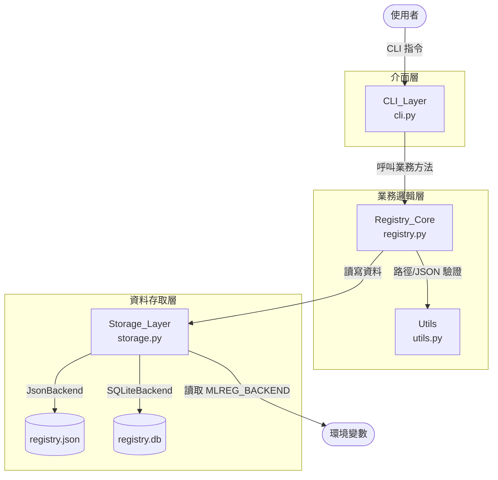
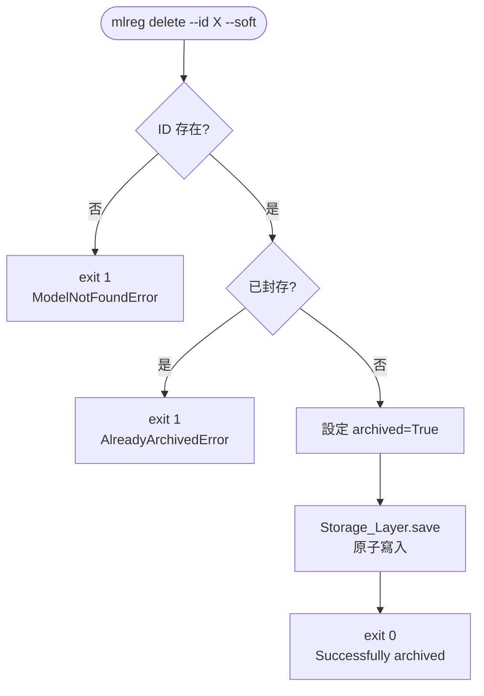
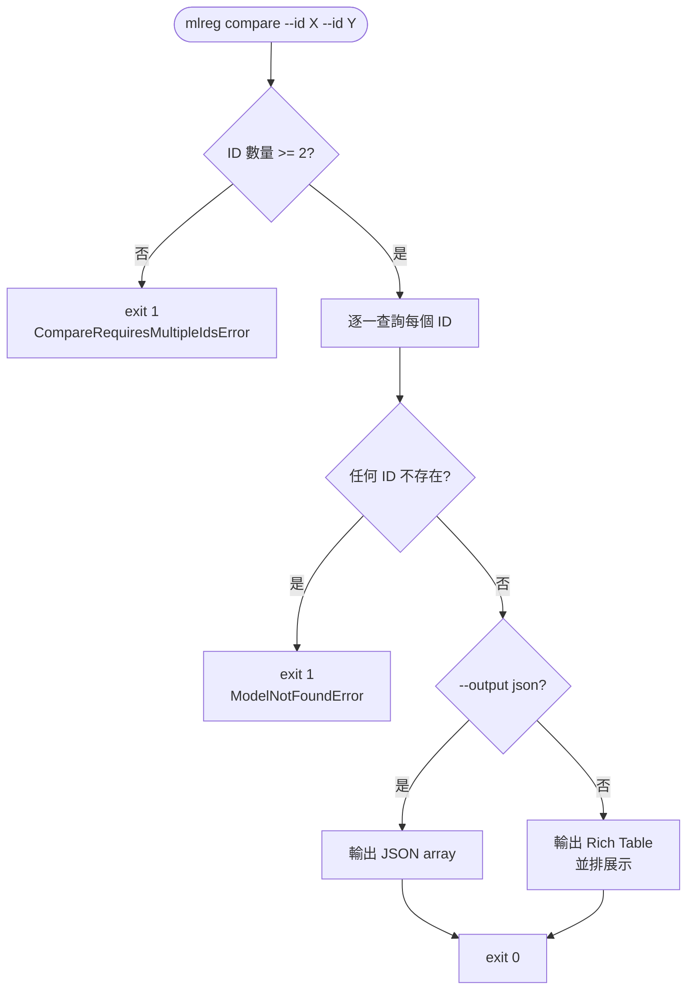
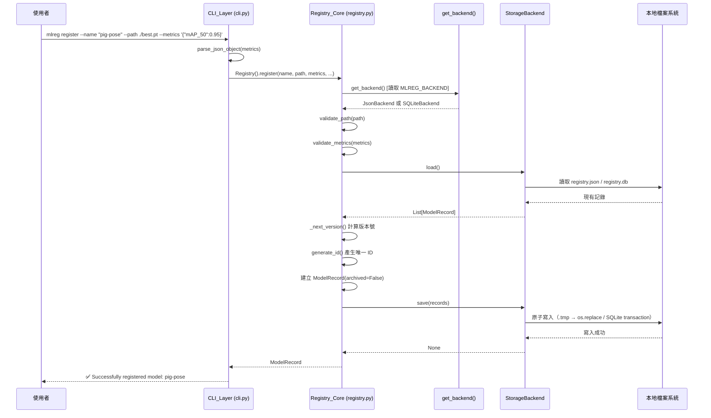
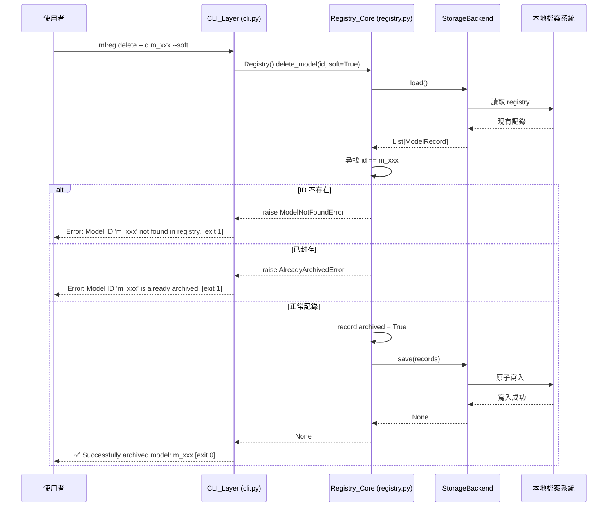

# Software Design Description (SDD)
## mlreg — Local MLOps Model Registry CLI

## 1. 專案概覽（Project Overview）

- **程式名稱：** `mlreg`（Local Model Registry）
- **程式版本：** v2.0
- **簡短描述（Elevator Pitch）：** 在 v1.0 輕量本地端 MLOps 模型註冊工具的基礎上，v2.0 新增機器可讀輸出、多版本並排比較、軟刪除封存機制，並將 Storage 層升級為 SQLite 後端，全面提升腳本整合能力與資料管理彈性，同時保持對 v1.0 CLI 契約的完整向下相容。
- **目標使用者：** 個人研究者、小型 AI 團隊、需要本地端模型資產管理的 MLOps 工程師
- **核心價值：** 延續 v1.0 的零雲端依賴設計，透過 JSON 輸出支援腳本自動化、`compare` 指令加速多版本決策、軟刪除保留歷史追溯能力，以及 SQLite 後端解決大量資料效能瓶頸

### v2.0 新增功能摘要

| 需求 | 類型 | 核心變更 |
|---|---|---|
| 需求一：`--output json` | 修改既有模組 | `list`、`info` 新增 `--output` 選填旗標，支援 `table`（預設）與 `json` 兩種格式 |
| 需求二：`compare` 指令 | 全新功能 | 新增 `compare` 指令，接受多個 `--id`，並排展示 metrics 與 hyperparameters |
| 需求三：`delete --soft` | 修改既有模組 | `delete` 新增 `--soft` 旗標；`list` 新增 `--show-archived` 旗標；`info` 顯示封存狀態 |
| 需求四：SQLiteBackend | 修改既有模組 | 新增 `SQLiteBackend`，透過 `MLREG_BACKEND` 環境變數切換；`Registry_Core` 無需修改 |

### 設計目標與品質屬性（Quality Attributes）

| 屬性 | 目標 | 驗證方式 |
|---|---|---|
| 向下相容性 | v1.0 所有 E2E 測試案例（#1–#32）全數繼續通過 | v2 測試套件包含 v1 全部案例 |
| 正確性 | 所有 v2 新增 CLI 指令的輸出與退出碼符合本文件規格 | 第 6 章 E2E 測試案例全數通過 |
| 可靠性 | 軟刪除不得損毀現有記錄；SQLiteBackend 寫入失敗不得損毀資料庫 | 測試案例 #S3、#S4、#Q4 |
| 可維護性 | Registry_Core 程式碼中不出現任何針對 SQLiteBackend 的特判或 import | StorageBackend ABC 介面驗證 |
| 可移植性 | 支援 macOS、Linux、Windows（bash / PowerShell / CMD） | OS 支援矩陣（同 v1.0） |

### System Context（v2.0 更新）

```
┌──────────────────────────────────────────────────────────────────────┐
│  使用者（AI 工程師）                                                   │
│    │  CLI 指令（mlreg register / list / info / delete / compare）     │
│    ▼                                                                  │
│  mlreg CLI（v2.0）                                                    │
│    │  讀取 MLREG_REGISTRY_PATH 環境變數（registry 路徑）               │
│    │  讀取 MLREG_BACKEND 環境變數（json / sqlite，預設 json）           │
│    │  讀寫 registry.json 或 registry.db（依後端設定）                  │
│    │  驗證 --path 指定的模型檔是否存在                                  │
│    ▼                                                                  │
│  本地檔案系統                                                          │
│    ├── registry.json（JsonBackend，由 mlreg 管理）                    │
│    ├── registry.db（SQLiteBackend，由 mlreg 管理）                    │
│    └── 模型權重檔（由使用者管理，mlreg 只驗證存在性）                   │
└──────────────────────────────────────────────────────────────────────┘
```

### 範疇外（Out of Scope，v2.0）

| 排除項目 | 設計取捨理由 |
|---|---|
| 遠端／雲端儲存後端 | 仍為零網路依賴工具；雲端整合留待 v3.0 |
| 並發寫入（多 process） | 本地單人使用場景不需要鎖定機制 |
| 模型檔案的上傳、複製或搬移 | mlreg 只管理 metadata |
| Web UI 或 REST API | CLI 是主要工作介面 |
| JSON → SQLite 資料遷移工具 | 不在本次需求範疇（列為加分項目） |
| 多使用者或權限控管 | 依賴 OS 檔案系統權限 |

### 假設與限制（Assumptions & Constraints）

| 項目 | 說明 |
|---|---|
| Python 版本 | >= 3.9 |
| OS 支援矩陣 | macOS 12+、Ubuntu 20.04+、Windows 10+（bash / PowerShell / CMD） |
| 外部依賴 | `typer`、`rich`（同 v1.0）；SQLiteBackend 使用 Python 標準函式庫 `sqlite3`，無額外依賴 |
| 並發存取 | 同一時間僅由單一 process 存取 registry，不保證並發安全 |
| MLREG_BACKEND | 環境變數，值為 `json`（預設）或 `sqlite`；其他值視為非法，exit 1 |
| SQLite 路徑 | 由 `MLREG_REGISTRY_PATH` 決定；若未設定，預設為執行目錄下的 `registry.db` |
| schema_version | v2.0 的 `registry.json` 仍使用 `"schema_version": "1.0"`；軟刪除欄位 `archived` 為選填，缺失時視為 `false`，確保與 v1.0 資料完全相容 |

---

## 2. CLI 介面規格（Interface Specification）

> 本節為 v2.0 向下相容契約。v1.0 所有必填參數的名稱與行為完整保留；v2.0 僅新增選填參數與新指令。

### 指令規格（完整，含 v1.0 繼承）

```
mlreg <command> [OPTIONS]
```

| 指令 | 參數 | 說明 | 範例 |
|---|---|---|---|
| `register` | `--name TEXT`（必填） | 專案/模型群組名稱 | `mlreg register --name "pig-pose" --path ./best.pt` |
| | `--path TEXT`（必填） | 模型權重檔本地路徑（需存在） | |
| | `--version TEXT`（選填） | 指定版本號；未指定時自動遞增 | `--version "v3"` |
| | `--metrics JSON`（選填） | 效能指標 key-value JSON，預設 `{}` | `--metrics '{"mAP_50": 0.95}'` |
| | `--params JSON`（選填） | 訓練超參數 key-value JSON，預設 `{}` | `--params '{"epochs": 300}'` |
| `list` | `--name TEXT`（選填） | 篩選指定 project_name | `mlreg list --name "pig-pose"` |
| | `--sort-by TEXT`（選填） | 依指定 metric key 排序（預設升冪） | `mlreg list --sort-by mAP_50` |
| | `--desc`（flag，選填） | 啟用降冪排序，需搭配 `--sort-by` | `mlreg list --sort-by mAP_50 --desc` |
| | `--output TEXT`（選填，**v2 新增**） | 輸出格式：`table`（預設）或 `json` | `mlreg list --output json` |
| | `--show-archived`（flag，選填，**v2 新增**） | 顯示已封存（軟刪除）記錄 | `mlreg list --show-archived` |
| `info` | `--id TEXT`（必填） | 查詢指定 ID 的模型完整資訊 | `mlreg info --id m_1710903810_a3f2` |
| | `--output TEXT`（選填，**v2 新增**） | 輸出格式：`table`（預設）或 `json` | `mlreg info --id <id> --output json` |
| `delete` | `--id TEXT`（必填） | 刪除指定 ID 的模型紀錄 | `mlreg delete --id m_1710903810_a3f2` |
| | `--soft`（flag，選填，**v2 新增**） | 軟刪除（封存）而非硬刪除 | `mlreg delete --id <id> --soft` |
| `compare` | `--id TEXT`（必填，可重複，**v2 新增**） | 指定要比較的模型 ID（至少 2 個） | `mlreg compare --id <id1> --id <id2>` |
| | `--output TEXT`（選填，**v2 新增**） | 輸出格式：`table`（預設）或 `json` | `mlreg compare --id <id1> --id <id2> --output json` |

### v2.0 新增邊界行為規格

| 情境 | 行為 | 退出碼 |
|---|---|---|
| `--output` 指定不支援的格式值 | stderr 輸出 `Error: Unsupported output format '<value>'. Supported formats: table, json.` | 1 |
| `list --show-archived` | 輸出包含正常記錄與已封存記錄；封存記錄在 `Status` 欄位顯示 `[archived]` | 0 |
| `list`（不加 `--show-archived`） | 已封存記錄不出現在輸出中 | 0 |
| `info --id <archived_id>` | 正常輸出，並在 `Status` 欄位顯示 `archived` | 0 |
| `delete --id <id> --soft`（記錄存在且未封存） | 標記為 archived；stdout 輸出 `✅ Successfully archived model: <id>` | 0 |
| `delete --id <id> --soft`（記錄已封存） | stderr 輸出 `Error: Model ID '<id>' is already archived.` | 1 |
| `delete --id <id>`（不加 `--soft`，記錄已封存） | 執行硬刪除，行為與 v1.0 相同；stdout 輸出 `✅ Successfully deleted model: <id>` | 0 |
| `compare` 僅提供 1 個 `--id` | stderr 輸出 `Error: compare requires at least 2 model IDs.` | 1 |
| `compare` 提供任何不存在的 ID | stderr 輸出 `Error: Model ID '<id>' not found in registry.` | 1 |
| `MLREG_BACKEND` 設定為非法值 | stderr 輸出 `Error: Unsupported backend '<value>'. Supported backends: json, sqlite.` | 1 |

### v1.0 邊界行為（完整繼承，不變）

| 情境 | 行為 | 退出碼 |
|---|---|---|
| `registry.json` 不存在時執行 `register` | 自動建立新的 `registry.json`，正常執行 | 0 |
| `registry.json` 不存在時執行 `list` | 視同 Registry 為空，stdout 輸出 `Info: No models registered yet.` | 0 |
| `registry.json` 不存在時執行 `info` | stderr 輸出 `Error: Model ID '<id>' not found in registry.` | 1 |
| `registry.json` 不存在時執行 `delete` | stderr 輸出 `Error: Model ID '<id>' not found in registry.` | 1 |
| `MLREG_REGISTRY_PATH` 指向一個目錄（非檔案） | stderr 輸出 `Error: MLREG_REGISTRY_PATH '<path>' is a directory, not a file.` | 1 |
| `--version` 指定已存在的版本號（同 `project_name` 下） | stderr 輸出 `Error: Version 'vX' already exists for project 'Y'.` | 1 |
| `--sort-by` 指定的 key 完全不存在於任何 record | 輸出原始列表；stderr 輸出 `Warning: Sort key 'X' not found in any record.` | 0 |
| `--desc` 未搭配 `--sort-by` | stderr 輸出 `Error: --desc requires --sort-by.` | 1 |

### 預期輸出格式（v2.0 新增）

**`list --output json` 輸出（stdout）：**
```json
[
  {
    "id": "m_1710903810_a3f2",
    "project_name": "pig-pose",
    "version": "v3",
    "file_path": "./runs/pose/train/weights/best.pt",
    "metrics": {"mAP_50": 0.95},
    "hyperparameters": {"epochs": 300},
    "created_at": "2026-03-20T10:30:00Z",
    "archived": false
  }
]
```

**`info --output json` 輸出（stdout）：**
```json
{
  "id": "m_1710903810_a3f2",
  "project_name": "pig-pose",
  "version": "v3",
  "file_path": "./runs/pose/train/weights/best.pt",
  "metrics": {"mAP_50": 0.95},
  "hyperparameters": {"epochs": 300},
  "created_at": "2026-03-20T10:30:00Z",
  "archived": false
}
```

**`compare` 成功輸出（Rich Table，stdout）：**
```
┌──────────────────────┬──────────────────────────────┬──────────────────────────────┐
│ Field                │ m_1710903810_a3f2             │ m_1710900000_b1c4             │
├──────────────────────┼──────────────────────────────┼──────────────────────────────┤
│ Project Name         │ pig-pose                     │ pig-pose                     │
│ Version              │ v3                           │ v2                           │
│ File Path            │ ./runs/train/best.pt         │ ./runs/train2/best.pt        │
│ Created At           │ 2026-03-20T10:30:00Z         │ 2026-03-19T08:00:00Z         │
│ [Metrics]            │                              │                              │
│   mAP_50             │ 0.95                         │ 0.90                         │
│   loss               │ 0.035                        │ 0.042                        │
│ [Hyperparameters]    │                              │                              │
│   epochs             │ 300                          │ 200                          │
│   batch_size         │ 16                           │ 32                           │
└──────────────────────┴──────────────────────────────┴──────────────────────────────┘
```

> 缺少特定 key 的欄位以 `—`（em dash）填充，確保對齊顯示。

**`compare --output json` 輸出（stdout）：**
```json
[
  {
    "id": "m_1710903810_a3f2",
    "project_name": "pig-pose",
    "version": "v3",
    "metrics": {"mAP_50": 0.95, "loss": 0.035},
    "hyperparameters": {"epochs": 300, "batch_size": 16},
    "created_at": "2026-03-20T10:30:00Z",
    "archived": false
  },
  {
    "id": "m_1710900000_b1c4",
    "project_name": "pig-pose",
    "version": "v2",
    "metrics": {"mAP_50": 0.90, "loss": 0.042},
    "hyperparameters": {"epochs": 200, "batch_size": 32},
    "created_at": "2026-03-19T08:00:00Z",
    "archived": false
  }
]
```

**`list --show-archived` 輸出（Rich Table，stdout）：**
```
┌──────────────────────┬──────────────────┬─────────┬──────────────────────────────────────┬──────────────────────┬────────────┐
│ ID                   │ Project Name     │ Version │ File Path                            │ Created At           │ Status     │
├──────────────────────┼──────────────────┼─────────┼──────────────────────────────────────┼──────────────────────┼────────────┤
│ m_1710903810_a3f2    │ pig-pose         │ v3      │ ./runs/pose/train/weights/best.pt    │ 2026-03-20T10:30:00Z │            │
│ m_1710900000_b1c4    │ pig-pose         │ v2      │ ./runs/pose/train2/weights/best.pt   │ 2026-03-19T08:00:00Z │ [archived] │
└──────────────────────┴──────────────────┴─────────┴──────────────────────────────────────┴──────────────────────┴────────────┘
```

> 一般 `list`（不加 `--show-archived`）不顯示 `Status` 欄位，與 v1.0 輸出格式完全一致。

**`delete --soft` 成功輸出（stdout）：**
```
✅ Successfully archived model: m_1710903810_a3f2
```

**輸出通道規範（繼承 v1.0，不變）：**
- `Error:` 訊息 → stderr
- `Warning:` 訊息 → stderr
- `Info:` 訊息 → stdout
- 成功訊息（`✅`）→ stdout
- JSON 輸出（`--output json`）→ stdout，不含任何 Rich 裝飾字元

---

## 3. 資料模型（Data Model）

### ModelRecord（v2.0 擴充）

| 欄位 | 型別 | 說明 | 必填 |
|---|---|---|---|
| `id` | `str` | 唯一識別碼，格式 `m_<unix_timestamp>_<4位隨機十六進位>` | ✅ |
| `project_name` | `str` | 模型群組名稱 | ✅ |
| `version` | `str` | 版本號 | ✅ |
| `file_path` | `str` | 模型權重檔的本地路徑（儲存原始字串） | ✅ |
| `metrics` | `dict[str, float \| int]` | 效能指標 key-value | ❌ |
| `hyperparameters` | `dict[str, Any]` | 訓練超參數 key-value | ❌ |
| `created_at` | `str` | ISO 8601 UTC 時間戳記，格式 `YYYY-MM-DDTHH:MM:SSZ` | ✅ |
| `archived` | `bool` | **v2 新增**：是否已封存（軟刪除）；預設 `False` | ❌（缺失視為 `False`） |

### 軟刪除（Soft Delete）設計

- `archived` 欄位為選填，缺失時視為 `False`，確保 v1.0 既有 registry.json 無需任何修改即可被 v2.0 正確讀取
- `schema_version` 維持 `"1.0"`，不升版；`archived` 欄位的引入屬於向後相容擴充（新欄位選填）
- 軟刪除後，記錄仍保留在 `models[]` 中，`archived` 設為 `true`
- 硬刪除（不加 `--soft`）行為與 v1.0 完全相同，直接從 `models[]` 移除記錄
- 版本號自動遞增計算時，**已封存記錄仍計入**（封存不等於刪除，版本號不釋放）
- `(project_name, version)` 唯一性約束：已封存記錄仍佔用版本號，不可重新 register 相同版本

### registry.json 整體結構（v2.0，含 archived 欄位）

```json
{
  "schema_version": "1.0",
  "models": [
    {
      "id": "m_1710903810_a3f2",
      "project_name": "pig-keypoint-yolo",
      "version": "v1",
      "file_path": "./runs/pose/train/weights/best.pt",
      "metrics": {"mAP_50": 0.95, "loss": 0.035},
      "hyperparameters": {"epochs": 300, "batch_size": 16},
      "created_at": "2026-03-20T10:30:00Z",
      "archived": false
    },
    {
      "id": "m_1710900000_b1c4",
      "project_name": "pig-keypoint-yolo",
      "version": "v2",
      "file_path": "./runs/pose/train2/weights/best.pt",
      "metrics": {"mAP_50": 0.90},
      "hyperparameters": {},
      "created_at": "2026-03-21T09:00:00Z",
      "archived": true
    }
  ]
}
```

### load() Record 驗證規格（v2.0 更新）

在 v1.0 驗證規則基礎上，新增：

| 驗證項目 | 規則 |
|---|---|
| `archived` 型別 | 若存在，必須為 `bool`；否則視為 `RegistryCorruptedError` |

缺失 `archived` 欄位不視為錯誤，`from_dict()` 預設為 `False`。

### SQLite Schema（SQLiteBackend）

```sql
CREATE TABLE IF NOT EXISTS models (
    id              TEXT PRIMARY KEY,
    project_name    TEXT NOT NULL,
    version         TEXT NOT NULL,
    file_path       TEXT NOT NULL,
    metrics         TEXT NOT NULL DEFAULT '{}',   -- JSON 序列化
    hyperparameters TEXT NOT NULL DEFAULT '{}',   -- JSON 序列化
    created_at      TEXT NOT NULL,
    archived        INTEGER NOT NULL DEFAULT 0,   -- 0=false, 1=true
    UNIQUE(project_name, version)
);
```

- `metrics` 與 `hyperparameters` 以 JSON 字串儲存，讀取時反序列化
- `archived` 以 INTEGER 儲存（0/1），讀取時轉換為 Python `bool`
- `SQLiteBackend` 的 `load()` 回傳所有記錄（含 archived），與 `JsonBackend` 行為一致；篩選邏輯由 `Registry_Core` 負責

### Data Invariants（v2.0，繼承 v1.0）

| 不變量 | 說明 |
|---|---|
| ID 全域唯一 | registry 中不得存在兩筆 `id` 相同的 ModelRecord（含 archived） |
| (project_name, version) 唯一 | 同一 `project_name` 下不得存在兩筆 `version` 相同的 ModelRecord（含 archived） |
| `created_at` 單調 | 同一 `project_name` 下，版本號較大的 record 其 `created_at` 不早於版本號較小的 record（僅適用於 `vN` 格式，含 archived） |
| `models` 為 array | registry.json 的 `models` 欄位必須為 JSON array |

---

## 4. 模組架構（Module Design）

### 系統整體架構（v2.0）



### 模組依賴關係（Import 關係，v2.0）

```
main.py       → cli.py
cli.py        → registry.py, exceptions.py
registry.py   → storage.py, models.py, utils.py, exceptions.py
storage.py    → models.py, exceptions.py
models.py     → (無依賴)
utils.py      → exceptions.py
exceptions.py → (無依賴)
```

無循環依賴。`models.py` 與 `exceptions.py` 為底層模組，不得 import 其他專案模組。

### 模組職責（v2.0 更新）

| 模組 | 檔案 | 職責（v2.0 變更以 **粗體** 標示） |
|---|---|---|
| Entry Point | `main.py` | CLI 程式進入點，呼叫 `cli.app()`；不含業務邏輯 |
| CLI_Layer | `cli.py` | 解析 CLI 參數（Typer）、呼叫 Registry_Core、格式化輸出（Rich / JSON）、統一捕捉 `MlregError`；**新增 `compare` 指令、`--output` 旗標、`--soft` 旗標、`--show-archived` 旗標** |
| Registry_Core | `registry.py` | 業務邏輯；**`delete_model()` 新增 `soft` 參數實現軟刪除（封存）；新增 `compare_models()` 方法；`list_models()` 新增 `show_archived` 參數** |
| Storage_Layer | `storage.py` | **新增 `SQLiteBackend`；新增 `get_backend()` 工廠函式，依 `MLREG_BACKEND` 環境變數回傳對應後端；`JsonBackend` 的 `_parse_records()` 新增 `archived` 欄位處理** |
| Models | `models.py` | **`ModelRecord` 新增 `archived: bool = False` 欄位；`to_dict()` / `from_dict()` 更新** |
| Utils | `utils.py` | 同 v1.0，無變更 |
| Exceptions | `exceptions.py` | **新增 `AlreadyArchivedError`、`UnsupportedBackendError`、`UnsupportedOutputFormatError`** |

### 核心流程：軟刪除（Soft Delete）



### 核心流程：compare



### Storage_Layer 工廠函式（v2.0 新增）

```python
def get_backend() -> StorageBackend:
    """依 MLREG_BACKEND 環境變數回傳對應後端實例。
    預設為 JsonBackend；設定為 'sqlite' 時回傳 SQLiteBackend。
    非法值拋出 UnsupportedBackendError。
    """
    backend_env = os.environ.get("MLREG_BACKEND", "json").lower()
    if backend_env == "json":
        return JsonBackend()
    elif backend_env == "sqlite":
        return SQLiteBackend()
    else:
        raise UnsupportedBackendError(
            f"Error: Unsupported backend '{backend_env}'. Supported backends: json, sqlite."
        )
```

`Registry_Core` 的 `__init__` 預設呼叫 `get_backend()`，確保 `Registry_Core` 程式碼中不出現任何針對 SQLiteBackend 的特判。

### SQLiteBackend 設計

```python
class SQLiteBackend(StorageBackend):
    """以 SQLite 資料庫為後端的 Storage 實作。"""

    def __init__(self) -> None:
        # 路徑邏輯與 JsonBackend 相同，但預設檔名為 registry.db
        env_path = os.environ.get("MLREG_REGISTRY_PATH")
        if env_path:
            base = env_path.replace(".json", ".db") if env_path.endswith(".json") else env_path
            self._path = os.path.join(os.getcwd(), base) if not os.path.isabs(base) else base
            self._validate_registry_path(self._path)
        else:
            self._path = os.path.join(os.getcwd(), "registry.db")
        self._init_db()

    def load(self) -> list[ModelRecord]: ...   # SELECT * FROM models
    def save(self, records: list[ModelRecord]) -> None: ...  # 全量替換（DELETE + INSERT in transaction）
```

**SQLiteBackend 寫入策略：** 使用 SQLite transaction（`BEGIN EXCLUSIVE`）確保原子性。`save()` 在 transaction 內執行 `DELETE FROM models` 後逐筆 `INSERT`；若任何步驟失敗，`ROLLBACK` 確保資料庫不損毀，並拋出 `StorageWriteError`。

### 建議目錄結構（v2.0）

```
v2/
├── main.py              ← CLI 入口（呼叫 cli.py 的 Typer app）
├── cli.py               ← CLI_Layer：Typer app，5 個指令
├── registry.py          ← Registry_Core：業務邏輯
├── storage.py           ← StorageBackend ABC + JsonBackend + SQLiteBackend + get_backend()
├── models.py            ← ModelRecord dataclass（含 archived 欄位）
├── utils.py             ← validate_path, parse_json_object, generate_id（同 v1.0）
├── exceptions.py        ← MlregError 及子類別（含 v2 新增例外）
├── requirements.txt
└── sdd_v2.md
```

---

## 5. 錯誤處理規格（Error Handling）

### 錯誤情境對照表（v2.0 完整，含 v1.0 繼承）

| 情境 | 輸出通道 | 訊息 | 退出碼 |
|---|---|---|---|
| `--path` 指定的檔案不存在 | stderr | `Error: Model file not found at <path>` | 1 |
| `--metrics` 或 `--params` 非合法 JSON 語法 | stderr | `Error: Invalid JSON syntax. Please ensure it is a valid JSON string.` | 1 |
| `--metrics` 或 `--params` 為合法 JSON 但非 object | stderr | `Error: Invalid JSON format. Expected a JSON object, got <type>.` | 1 |
| `--metrics` values 包含非數值型別或 NaN / Infinity | stderr | `Error: Invalid metrics value for key '<key>'. Expected finite numeric value.` | 1 |
| `register` 缺少 `--name` 或 `--path` | stderr | Typer 自動輸出 | 2 |
| `info` 或 `delete` 缺少 `--id` | stderr | Typer 自動輸出 | 2 |
| `info --id` 或 `delete --id` 指定的 ID 不存在 | stderr | `Error: Model ID '<id>' not found in registry.` | 1 |
| `register --version` 指定版本號已存在（同 project_name） | stderr | `Error: Version '<version>' already exists for project '<name>'.` | 1 |
| `--desc` 未搭配 `--sort-by` | stderr | `Error: --desc requires --sort-by.` | 1 |
| `--sort-by` key 完全不存在於任何 record | stderr | `Warning: Sort key '<key>' not found in any record.` | 0 |
| `list` 篩選結果為空 | stdout | `Info: No models found matching criteria.` | 0 |
| Registry 完全為空 | stdout | `Info: No models registered yet.` | 0 |
| `registry.json` JSON 語法損毀 | stderr | `Error: registry.json is corrupted. Please restore from backup or delete the file to start fresh.` | 1 |
| `registry.json` 格式合法但結構不符 | stderr | `Error: registry.json is corrupted at record[<index>]: <field> <reason>. Please restore from backup or delete the file to start fresh.` | 1 |
| `registry.json` 的 `schema_version` 非 `"1.0"` | stderr | `Error: Unsupported schema version '<version>'. Please upgrade mlreg.` | 1 |
| `registry.json` 寫入失敗 | stderr | `Error: Failed to write registry: <os_error_message>` | 1 |
| `MLREG_REGISTRY_PATH` 指向目錄 | stderr | `Error: MLREG_REGISTRY_PATH '<path>' is a directory, not a file.` | 1 |
| `MLREG_REGISTRY_PATH` 的 parent directory 不存在 | stderr | `Error: Parent directory of MLREG_REGISTRY_PATH '<path>' does not exist.` | 1 |
| ID 碰撞超過最大重試次數 | stderr | `Error: Failed to write registry: ID generation collision exceeded retry limit.` | 1 |
| **`--output` 指定不支援的格式值**（v2 新增） | stderr | `Error: Unsupported output format '<value>'. Supported formats: table, json.` | 1 |
| **`delete --soft` 對已封存記錄**（v2 新增） | stderr | `Error: Model ID '<id>' is already archived.` | 1 |
| **`compare` 僅提供 1 個 ID**（v2 新增） | stderr | `Error: compare requires at least 2 model IDs.` | 1 |
| **`MLREG_BACKEND` 設定為非法值**（v2 新增） | stderr | `Error: Unsupported backend '<value>'. Supported backends: json, sqlite.` | 1 |
| **SQLite 寫入失敗**（v2 新增） | stderr | `Error: Failed to write registry: <error_message>` | 1 |

### 例外層級設計（v2.0 完整）

```python
class MlregError(Exception):
    """所有業務邏輯例外的基底類別"""
    def __init__(self, message: str, exit_code: int = 1):
        super().__init__(message)
        self.exit_code = exit_code

# 資料驗證類（繼承自 v1.0）
class JsonSyntaxError(MlregError): ...
class JsonTypeError(MlregError): ...
class MetricsValidationError(MlregError): ...

# 業務邏輯類（繼承自 v1.0）
class ModelNotFoundError(MlregError): ...
class ModelFileNotFoundError(MlregError): ...
class VersionConflictError(MlregError): ...

# 業務邏輯類（v2.0 新增）
class AlreadyArchivedError(MlregError): ...          # 對已封存記錄執行 --soft
class CompareRequiresMultipleIdsError(MlregError): ... # compare 僅提供 1 個 ID

# 儲存層類（繼承自 v1.0）
class RegistryCorruptedError(MlregError): ...
class UnsupportedSchemaVersionError(MlregError): ...
class StorageWriteError(MlregError): ...
class InvalidRegistryPathError(MlregError): ...

# 儲存層類（v2.0 新增）
class UnsupportedBackendError(MlregError): ...       # MLREG_BACKEND 非法值
class UnsupportedOutputFormatError(MlregError): ...  # --output 非法值
```

### 退出碼規範（繼承 v1.0，不變）

| 退出碼 | 語意 | 觸發情境 |
|---|---|---|
| `0` | 成功 | 所有指令正常完成（含 Warning） |
| `1` | 業務邏輯錯誤 | 檔案不存在、ID 不存在、JSON 格式無效、版本號重複、schema 不支援、系統 I/O 錯誤、registry 損毀、已封存、非法格式值 |
| `2` | 參數解析錯誤 | 缺少必填參數、未知指令、未定義參數 |

---

## 6. 測試案例（Test Cases）

### 測試基礎設施（繼承 v1.0）

| 項目 | 說明 |
|---|---|
| 測試框架 | `pytest` |
| 執行方式 | 透過 `subprocess.run()` 呼叫 CLI，捕捉 `stdout`、`stderr` 與 exit code |
| 隔離策略 | 每個測試使用 pytest `tmp_path` fixture 建立獨立的暫存目錄，並透過 `MLREG_REGISTRY_PATH` 環境變數指向該目錄下的 registry 檔案 |
| 執行指令 | `pytest v2/tests/ -v` |

### 測試分層策略（v2.0）

| 層級 | 範疇 | 工具 | 說明 |
|---|---|---|---|
| Unit | 單一函式（`validate_path`、`parse_json_object`、`generate_id`、`ModelRecord.to_dict/from_dict`） | pytest（直接呼叫） | 不依賴 CLI 或檔案系統 |
| Integration | Registry_Core + Storage_Layer（不經 CLI） | pytest（直接呼叫 `registry.py`） | 驗證業務邏輯與儲存層的協作；含 SQLiteBackend 測試 |
| E2E | 完整 CLI 流程 | pytest + subprocess | 本章所有 E2E 案例 |

### v1.0 測試案例（#1–#32，全數繼承，不變）

v2.0 測試套件完整包含 v1.0 所有 32 個測試案例，確保向下相容性。詳見 `v1/sdd_v1.md` 第 6 章。

### v2.0 新增測試案例

#### 需求一：`--output json`

| # | 層級 | 輸入指令 / 操作 | 前置條件 | 預期 stdout | 預期 stderr | 退出碼 |
|---|---|---|---|---|---|---|
| O1 | E2E | `mlreg list --output json` | Registry 有 2 筆記錄 | 可被 `json.loads()` 解析；為 JSON array；每筆含 `id`、`project_name`、`version`、`file_path`、`metrics`、`hyperparameters`、`created_at`、`archived` | 空 | 0 |
| O2 | E2E | `mlreg list --output json` | Registry 為空 | `[]` | 空 | 0 |
| O3 | E2E | `mlreg info --id <valid_id> --output json` | Registry 含該 ID | 可被 `json.loads()` 解析；為 JSON object；含所有欄位 | 空 | 0 |
| O4 | E2E | `mlreg list --output json --sort-by mAP_50 --desc` | Registry 含 3 筆，mAP_50 分別為 0.9、0.95、0.8 | JSON array，第一筆 mAP_50=0.95，第二筆 0.9，第三筆 0.8 | 空 | 0 |
| O5 | E2E | `mlreg list --output json --name "pig-pose"` | Registry 含 pig-pose 與其他專案 | JSON array，所有元素的 project_name 均為 pig-pose | 空 | 0 |
| O6 | E2E | `mlreg list --output invalid` | 任意 | 空 | 含 "Unsupported output format" | 1 |
| O7 | E2E | `mlreg info --id <valid_id> --output invalid` | Registry 含該 ID | 空 | 含 "Unsupported output format" | 1 |
| O8 | E2E | `mlreg list`（不加 `--output`） | Registry 有記錄 | 含 Rich Table 欄位標題（與 v1.0 完全一致） | 空 | 0 |

#### 需求二：`compare` 指令

| # | 層級 | 輸入指令 / 操作 | 前置條件 | 預期 stdout | 預期 stderr | 退出碼 |
|---|---|---|---|---|---|---|
| C1 | E2E | `mlreg compare --id <id1> --id <id2>` | 兩個 ID 均存在，metrics 有重疊 key | 含兩個 ID；含 metrics key；含 hyperparameters key | 空 | 0 |
| C2 | E2E | `mlreg compare --id <id1> --id <id2>`（id1 有 mAP_50，id2 無） | 兩個 ID 均存在 | 輸出中 id2 對應的 mAP_50 欄位顯示 `—`；不 crash | 空 | 0 |
| C3 | E2E | `mlreg compare --id <id1> --id m_9999999999_0000` | id1 存在，id2 不存在 | 空 | 含 "not found" | 1 |
| C4 | E2E | `mlreg compare --id <id1>` | id1 存在 | 空 | 含 "at least 2 model IDs" | 1 |
| C5 | E2E | `mlreg compare --id <id1> --id <id2> --output json` | 兩個 ID 均存在 | 可被 `json.loads()` 解析；為 JSON array，長度為 2 | 空 | 0 |
| C6 | E2E | `mlreg compare --id <id1> --id <id2> --id <id3>` | 三個 ID 均存在 | 輸出含三個 ID 的資訊 | 空 | 0 |

#### 需求三：`delete --soft`

| # | 層級 | 輸入指令 / 操作 | 前置條件 | 預期 stdout | 預期 stderr | 退出碼 |
|---|---|---|---|---|---|---|
| S1 | E2E | `mlreg delete --id <id> --soft` | Registry 含該 ID（未封存） | 含 "Successfully archived" | 空 | 0 |
| S2 | E2E | `mlreg list` | 接續 S1 | 不含已封存的 ID | 空 | 0 |
| S3 | E2E | `mlreg list --show-archived` | 接續 S1 | 含已封存的 ID；含 `[archived]` 標示 | 空 | 0 |
| S4 | E2E | `mlreg info --id <archived_id>` | 接續 S1 | 含該 ID 的完整資訊；含 `archived` 狀態標示 | 空 | 0 |
| S5 | E2E | `mlreg delete --id <archived_id> --soft` | 接續 S1（已封存） | 空 | 含 "already archived" | 1 |
| S6 | E2E | `mlreg delete --id <archived_id>`（不加 `--soft`） | 接續 S1（已封存） | 含 "Successfully deleted" | 空 | 0 |
| S7 | E2E | `mlreg list` | 接續 S6（硬刪除後） | 不含已刪除的 ID | 空 | 0 |
| S8 | E2E | `mlreg register --name "test" --path ./dummy.pt`（軟刪除後再 register 同名） | 接續 S1；dummy.pt 存在 | 版本號為 v2（軟刪除記錄仍佔用 v1） | 空 | 0 |
| S9 | Integration | `list_models(show_archived=False)` | Registry 含 1 筆正常 + 1 筆 archived | 回傳 1 筆（正常記錄） | — | — |
| S10 | Integration | `list_models(show_archived=True)` | Registry 含 1 筆正常 + 1 筆 archived | 回傳 2 筆 | — | — |

#### 需求四：SQLiteBackend

| # | 層級 | 輸入指令 / 操作 | 前置條件 | 預期 stdout | 預期 stderr | 退出碼 |
|---|---|---|---|---|---|---|
| Q1 | E2E | `MLREG_BACKEND=sqlite mlreg register --name "test" --path ./dummy.pt` | dummy.pt 存在 | 含 "Successfully registered" | 空 | 0 |
| Q2 | E2E | `MLREG_BACKEND=sqlite mlreg list` | 接續 Q1 | 含表格欄位標題 | 空 | 0 |
| Q3 | E2E | `MLREG_BACKEND=sqlite mlreg info --id <id>` | 接續 Q1 | 含所有欄位 | 空 | 0 |
| Q4 | E2E | `MLREG_BACKEND=sqlite mlreg delete --id <id>` | 接續 Q1 | 含 "Successfully deleted" | 空 | 0 |
| Q5 | E2E | `MLREG_BACKEND=invalid mlreg list` | 任意 | 空 | 含 "Unsupported backend" | 1 |
| Q6 | Integration | `SQLiteBackend.load()` 後 `SQLiteBackend.save()` | 空資料庫 | 回傳空列表；寫入後可正確讀回 | — | — |
| Q7 | Integration | `SQLiteBackend` 版本號自動遞增 | 已有 v1 記錄 | 新記錄版本號為 v2 | — | — |
| Q8 | Integration | `SQLiteBackend` (project_name, version) 唯一性 | 已有 (test, v1) 記錄 | 拋出 `VersionConflictError` | — | — |
| Q9 | E2E | `MLREG_BACKEND=sqlite mlreg list --output json` | 接續 Q1 | 可被 `json.loads()` 解析 | 空 | 0 |
| Q10 | E2E | `MLREG_BACKEND=sqlite mlreg delete --id <id> --soft` | 接續 Q1 | 含 "Successfully archived" | 空 | 0 |

### 需求—測試追溯矩陣（v2.0 完整）

| 需求 / 行為 | 對應測試案例 |
|---|---|
| v1.0 全部需求 | #1–#32（完整繼承） |
| list --output json | #O1, #O2, #O4, #O5 |
| list --output json 空 registry | #O2 |
| info --output json | #O3 |
| --output 非法值 | #O6, #O7 |
| list 不加 --output 與 v1.0 一致 | #O8 |
| compare 成功（含缺 key） | #C1, #C2 |
| compare ID 不存在 | #C3 |
| compare 僅 1 個 ID | #C4 |
| compare --output json | #C5 |
| compare 3 個 ID | #C6 |
| delete --soft 成功 | #S1 |
| list 不顯示 archived | #S2 |
| list --show-archived 顯示 archived | #S3 |
| info 顯示 archived 狀態 | #S4 |
| delete --soft 對已封存記錄 | #S5 |
| delete（硬刪除）對已封存記錄 | #S6, #S7 |
| 軟刪除後版本號不釋放 | #S8 |
| list_models show_archived 篩選 | #S9, #S10 |
| SQLiteBackend register/list/info/delete | #Q1–#Q4 |
| MLREG_BACKEND 非法值 | #Q5 |
| SQLiteBackend load/save | #Q6 |
| SQLiteBackend 版本號遞增 | #Q7 |
| SQLiteBackend 唯一性約束 | #Q8 |
| SQLiteBackend + --output json | #Q9 |
| SQLiteBackend + --soft | #Q10 |

---

## 7. v1.0 → v2.0 變更摘要（Change Summary）

### 對應關係總覽

| 項目 | v1.0 | v2.0 | 變更類型 |
|---|---|---|---|
| `models.py` | `ModelRecord`（7 欄位） | `ModelRecord`（8 欄位，新增 `archived`） | 修改 |
| `exceptions.py` | 10 個例外類別 | 14 個例外類別（新增 4 個） | 修改 |
| `storage.py` | `StorageBackend` ABC + `JsonBackend` | 新增 `SQLiteBackend` + `get_backend()` 工廠函式 | 修改 |
| `registry.py` | 4 個方法 | 6 個方法（`delete_model()` 新增 `soft` 參數實現軟刪除；新增 `compare_models()`）；`list_models` 新增 `show_archived` 參數 | 修改 |
| `cli.py` | 4 個指令 | 5 個指令（新增 `compare`）；`list`、`info` 新增 `--output`；`list` 新增 `--show-archived`；`delete` 新增 `--soft` | 修改 |
| `utils.py` | 無變更 | 無變更 | 繼承 |
| `main.py` | 無變更 | 無變更 | 繼承 |
| `requirements.txt` | `typer`, `rich`, `pytest` | 同 v1.0（SQLite 使用標準函式庫） | 繼承 |

### 向下相容性保證

1. **CLI 介面**：v1.0 所有必填參數名稱與行為完整保留；v2.0 僅新增選填參數與新指令
2. **資料格式**：`schema_version` 維持 `"1.0"`；`archived` 欄位選填，缺失視為 `false`，v1.0 產生的 registry.json 可被 v2.0 直接讀取
3. **退出碼**：v1.0 所有退出碼行為完整保留
4. **輸出格式**：不加 `--output` 時，`list` 與 `info` 的輸出與 v1.0 完全一致
5. **測試案例**：v1.0 所有 32 個測試案例在 v2.0 測試套件中全數繼續通過

### 設計決策說明

| 決策 | 選擇 | 理由 |
|---|---|---|
| 軟刪除的 schema_version | 維持 `"1.0"` | `archived` 為選填欄位，不破壞現有 load() 驗證邏輯；升版會導致 v1.0 工具無法讀取 v2.0 資料 |
| 軟刪除後版本號是否釋放 | 不釋放 | 封存 ≠ 刪除；保留歷史追溯能力；避免版本號語意混亂 |
| SQLiteBackend 路徑 | 沿用 `MLREG_REGISTRY_PATH`，副檔名自動轉換 | 最小化使用者設定負擔；與 JsonBackend 路徑邏輯一致 |
| compare 的 ID 傳入方式 | 多次 `--id`（Typer `List[str]`） | 語意清晰；與 `info`、`delete` 的 `--id` 風格一致；支援任意數量 |
| --output 的格式值 | `table`（預設）/ `json` | `table` 明確表達預設行為；`json` 為機器可讀標準格式 |
| SQLiteBackend 寫入策略 | 全量替換（transaction） | 與 JsonBackend 的 `save(records)` 介面一致；SQLite transaction 保證原子性 |


---

## 8. 向下相容性設計（Backward Compatibility）

### 保留的 v1.0 介面

| v1.0 指令 / 行為 | v2.0 行為 | 是否相容 |
|---|---|---|
| `mlreg register --name TEXT --path TEXT` | 行為完全不變 | ✅ 完全相容 |
| `mlreg register --version TEXT` | 行為完全不變 | ✅ 完全相容 |
| `mlreg register --metrics JSON` | 行為完全不變 | ✅ 完全相容 |
| `mlreg register --params JSON` | 行為完全不變 | ✅ 完全相容 |
| `mlreg list` | 輸出格式不變（不顯示 archived 記錄，不顯示 Status 欄位） | ✅ 完全相容 |
| `mlreg list --name TEXT` | 行為完全不變 | ✅ 完全相容 |
| `mlreg list --sort-by TEXT` | 行為完全不變 | ✅ 完全相容 |
| `mlreg list --sort-by TEXT --desc` | 行為完全不變 | ✅ 完全相容 |
| `mlreg info --id TEXT` | 輸出新增 `Status: active/archived` 行；v1.0 測試案例 #11 僅驗證 stdout 含 `ID`、`Project Name`、`Version`、`File Path`、`Created At`、`Metrics`、`Hyperparameters` 等欄位（`assert field in r.stdout`），新增行不破壞任何斷言，已驗證全數通過 | ✅ 完全相容 |
| `mlreg delete --id TEXT` | 行為完全不變（硬刪除） | ✅ 完全相容 |
| 所有退出碼（0 / 1 / 2） | 完全保留 | ✅ 完全相容 |
| 所有錯誤訊息格式 | 完全保留 | ✅ 完全相容 |
| `MLREG_REGISTRY_PATH` 環境變數 | 行為完全不變 | ✅ 完全相容 |
| `registry.json` 資料格式（schema_version 1.0） | 維持 `"1.0"`；v1.0 產生的資料可被 v2.0 直接讀取 | ✅ 完全相容 |

### 破壞性變更（Breaking Changes）

**本版本無 Breaking Changes。**

v2.0 所有修改均為「新增選填參數」或「新增指令」，未修改或刪除任何 v1.0 已定義的參數名稱、行為或輸出格式。

### 遷移策略（Migration Strategy）

**資料遷移：不需要。**

v2.0 的 `registry.json` 格式與 v1.0 完全相容：
- `schema_version` 維持 `"1.0"`，v1.0 工具可直接讀取 v2.0 產生的資料
- `archived` 欄位為選填，v1.0 的 `from_dict()` 使用 `data.get()` 讀取欄位，多出的 `archived` 欄位會被靜默忽略
- v1.0 產生的資料（無 `archived` 欄位）被 v2.0 讀取時，`from_dict()` 的 `data.get("archived", False)` 自動補預設值 `False`

**後端切換（JSON → SQLite）：**
目前需手動重新 register 所有模型。若需自動遷移，可執行以下 Python 腳本（非正式功能，僅供參考）：

```python
# 手動遷移範例（非正式功能）
import json, os
os.environ["MLREG_BACKEND"] = "sqlite"
from v2.storage import JsonBackend, SQLiteBackend

json_backend = JsonBackend()   # 讀取 registry.json
sqlite_backend = SQLiteBackend()  # 寫入 registry.db
records = json_backend.load()
sqlite_backend.save(records)
print(f"Migrated {len(records)} records to SQLite.")
```

### 向下相容性驗證

v2.0 測試套件完整包含 v1.0 所有 32 個測試案例，並在 CI 中自動執行：

```bash
# 執行 v1.0 相容性測試（包含在 v2.0 測試套件中）
python -m pytest v2/tests/ -v
```

**驗證結果：v1.0 全部 32 個測試案例在 v2.0 環境下全數通過（含 E2E #1–#24、Unit #4c/#4d/#25–#27/#32、Integration #28–#31）。**

---

## 9. 核心流程 Sequence Diagram

### Register 完整流程（含 v2.0 後端切換）



### Soft Delete 完整流程


